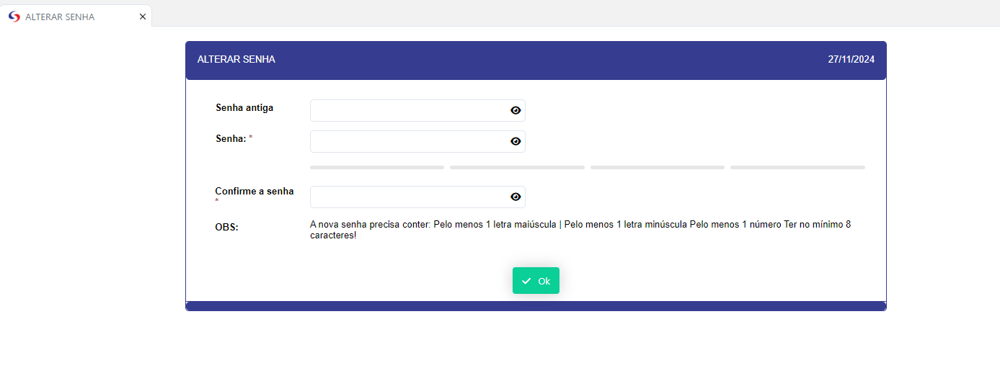

# ALTERAR SENHA 

- **Descrição**: Abre uma aplicação para alteração da senha do usuario 

    <label for="modal-toggle-5">

</label>
<input type="checkbox" id="modal-toggle-5" style="display:none;">

<label for="modal-toggle-5" class="close">&times;</label>

- **Passo a Passo** : 
- Preencha o primeiro campo com a senha antiga.
- Preencha o segundo campo com a nova senha.
- Prenche o terceiro campo novamente com  a nova senha criada.
- Após isso pressione o botão ok e sua senha está alterada.

- **Observação**  : As senhas criadas devem conter no minimo 8 caracteres, uma letra maiuscula, e um valor númerico.