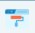
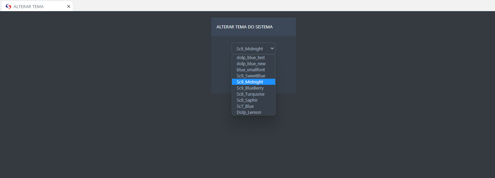

# ALTERAR TEMA 

- **Descrição**: Abre uma aplicação para modificação da visualização do tema do sistema.

<label for="modal-toggle-6">

</label>
<input type="checkbox" id="modal-toggle-6" style="display:none;">

<label for="modal-toggle-6" class="close">&times;</label>

- **Passo a Passo**: 

- Selecione o tema desejado e aperte o botão "OK" e será atualizado o tema do sistema. 