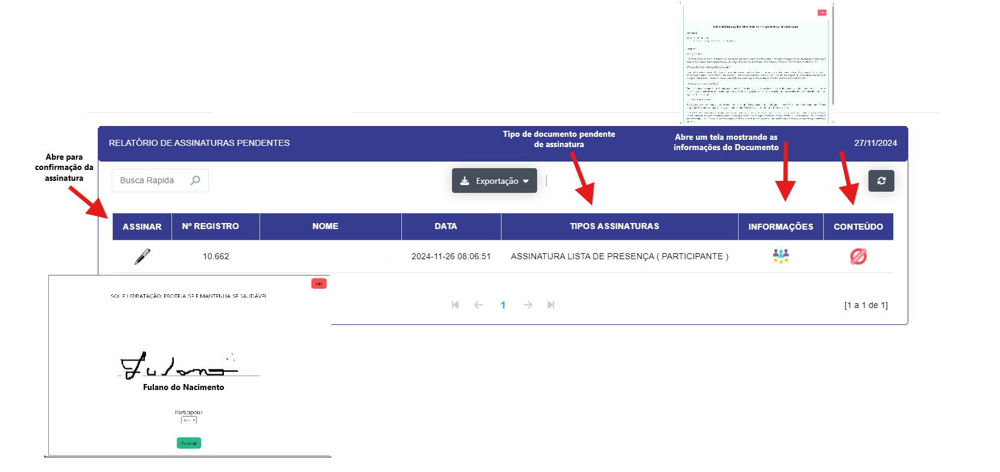
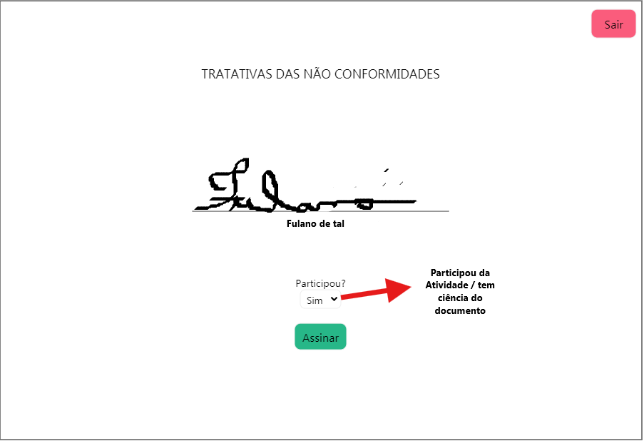
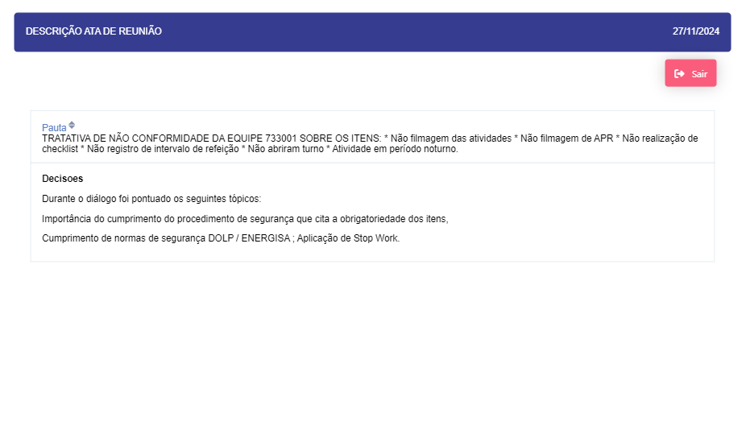

## ASSINATURAS GERAIS 

- **Descrição**: Abre um relatório das assinaturas pendentes.

<label for="modal-toggle-7">

</label>
<input type="checkbox" id="modal-toggle-7" style="display:none;">

<label for="modal-toggle-7" class="close">&times;</label>

 

- **Passo a passo**: 

- Ao clicar no botão" ASSINAR" se abre uma tela para a assinatura do Documento/Atividade.

<label for="modal-toggle-8">

</label>
<input type="checkbox" id="modal-toggle-8" style="display:none;">

<label for="modal-toggle-8" class="close">&times;</label>

- Ao clicar no botão "INFORMAÇÕES" se abrirá uma tela mostrando os conteúdos da atividade.

<label for="modal-toggle-9">

</label>
<input type="checkbox" id="modal-toggle-9" style="display:none;">

<label for="modal-toggle-9" class="close">&times;</label>

