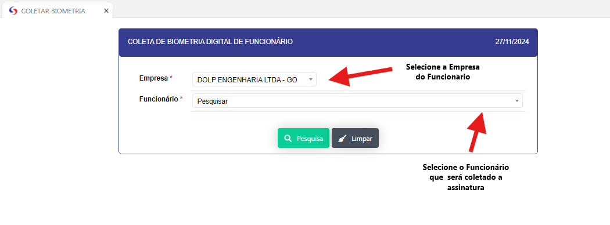
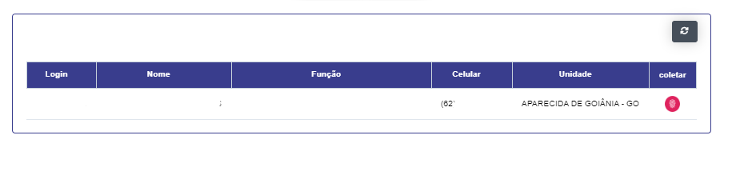
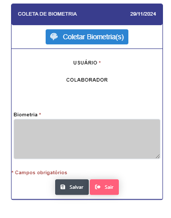

# COLETAR BIOMETRIA 

- **Descrição**: Aplicação para coleta da Biometria digital (Impressão digital) dos colaboradores.

- **ATENÇÃO ESTA APLICAÇÃO ESTA RESTRITA SOMENTE A GRUPOS AUTORIZADOS**

<label for="modal-toggle-1">

</label>
<input type="checkbox" id="modal-toggle-1" style="display:none;">

<label for="modal-toggle-1" class="close">&times;</label>

- **Passo a Passo**: 
- Ao clicar no campo empresa selecione a empresa da qual será coleta a biometria do colaborador.
- Ao clicar no campo funcionario selecione o funcionario que terá a biometria coletada.

<label for="modal-toggle-2">

</label>
<input type="checkbox" id="modal-toggle-2" style="display:none;">

<label for="modal-toggle-2" class="close">&times;</label>

- Ao clicar no icone coletar se abrir um tela para a coleta da biometria digital , o scaner da leitura da biometria precisa estar instalado e configurado na maquina. 

<label for="modal-toggle-3">

</label>
<input type="checkbox" id="modal-toggle-3" style="display:none;">

<label for="modal-toggle-3" class="close">&times;</label>

- As informações do colaborador aparecerção na tela , após confirma-las prescione o botão coletar Biometria(s), e abrira a tela do scaner biometrico, sigo as intruções do mesmo e ao final o registro será enviado ao sistema. 