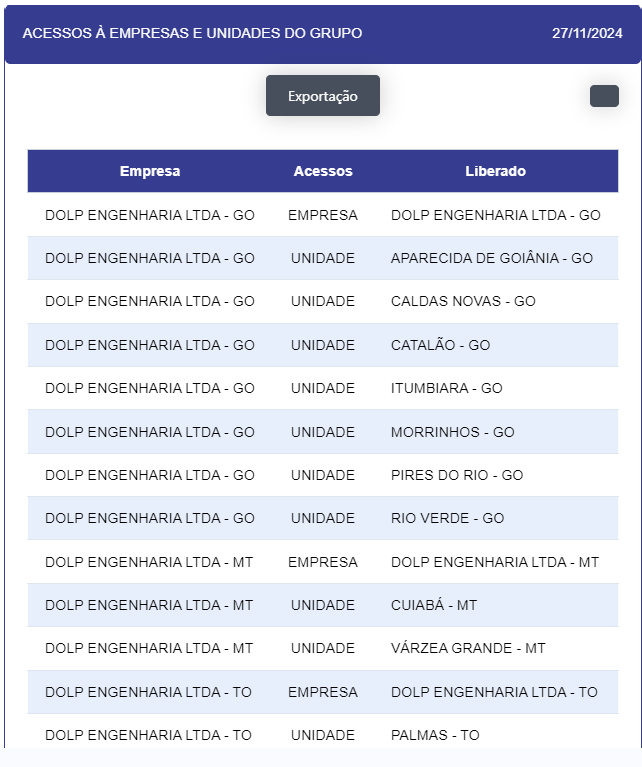

# MEUS ACESSOS 

- **Descrição** : Aplicação que retorna os acessos dos usuários por empresa e unidade.

<label for="modal-toggle-13">

</label>
<input type="checkbox" id="modal-toggle-13" style="display:none;">

<label for="modal-toggle-13" class="close">&times;</label>

