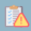
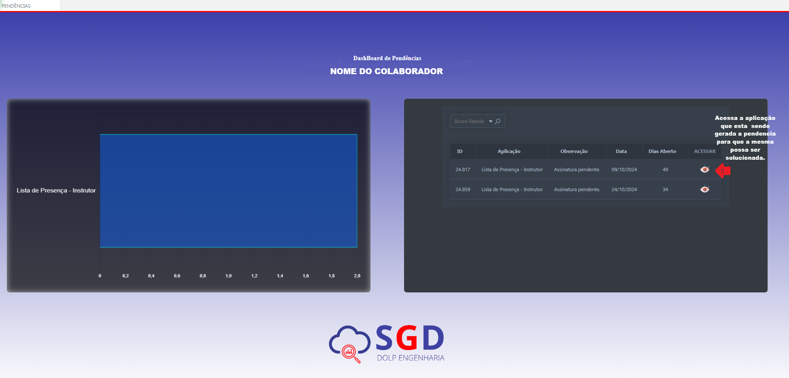

# PENDENCIAS 

 - **Descrição** : Retorna a página inicial onde se mostra as pendências que o usuário tem no sistema.

  <label for="modal-toggle-14">
  
    </label>
    <input type="checkbox" id="modal-toggle-14" style="display:none;">
    

    <label for="modal-toggle-14" class="close">&times;</label>
    
    

    
- **Passo a passo** : Ao clicar no ícone O usuário será redirecionado a aplicação na qual está sendo gerando a pendência.