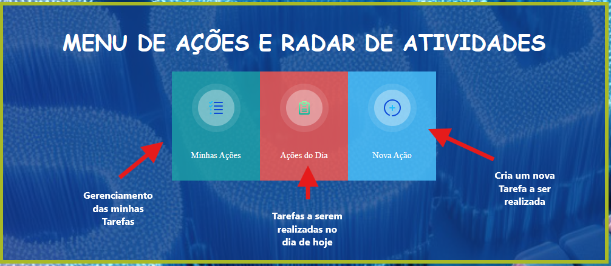
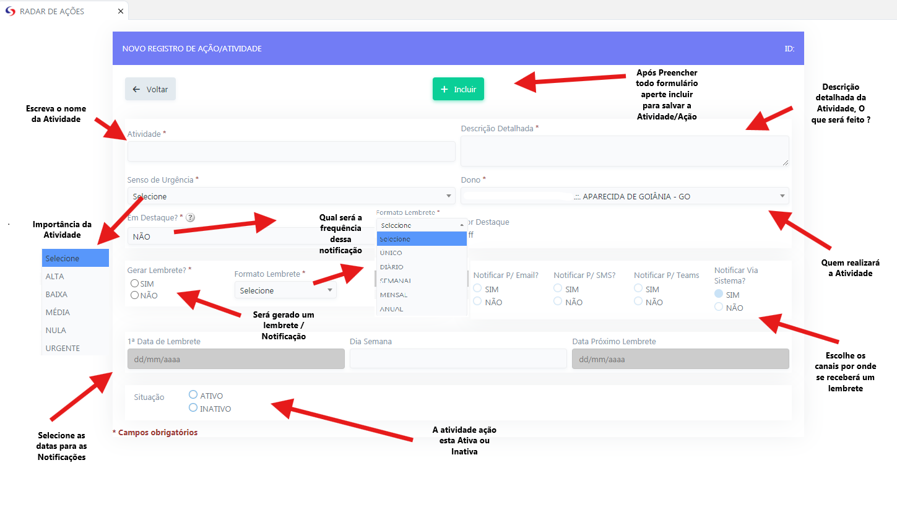
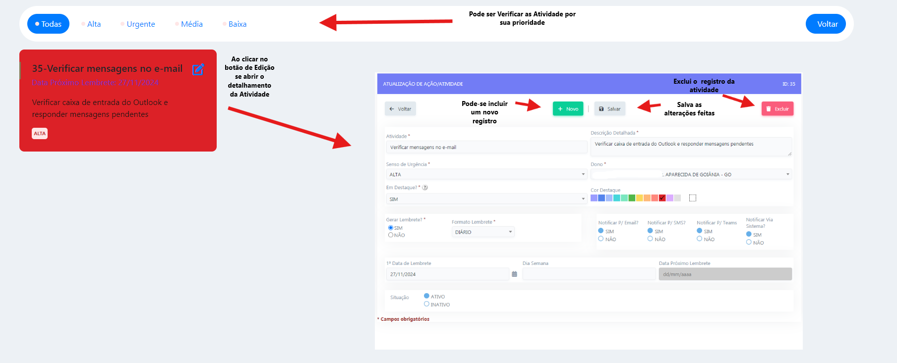
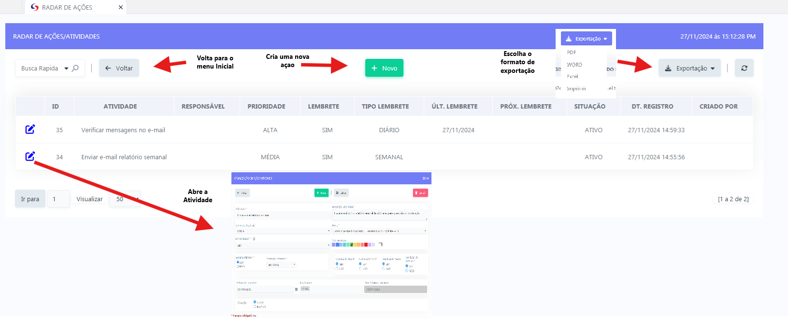

# RADAR DE AÇÕES  

 - **Descrição**: Aplicação de gerenciamento de tarefas e ações do usuário.

    <label for="modal-toggle-1">
    
    </label>
    <input type="checkbox" id="modal-toggle-1" style="display:none;">
    

    <label for="modal-toggle-1" class="close">&times;</label>
    
    

- **Passo a Passo**: 
- Ao abrir o botão "Nova Ação" - se abrirá um menu para criação de uma nova tarefa
<label for="modal-toggle-2">

</label>
<input type="checkbox" id="modal-toggle-2" style="display:none;">

<label for="modal-toggle-2" class="close">&times;</label>

- Ao abrir o botão "Ações do Dia" - Se abrirá um relatorio das atividades programdadas para o Dia
<label for="modal-toggle-3">

</label>
<input type="checkbox" id="modal-toggle-3" style="display:none;">

<label for="modal-toggle-3" class="close">&times;</label>

- Ao abrir o botão "Minhas Ações" - Se abrirá um relatorio de todas suas Atividades
<label for="modal-toggle-4">

</label>
<input type="checkbox" id="modal-toggle-4" style="display:none;">

<label for="modal-toggle-4" class="close">&times;</label>

