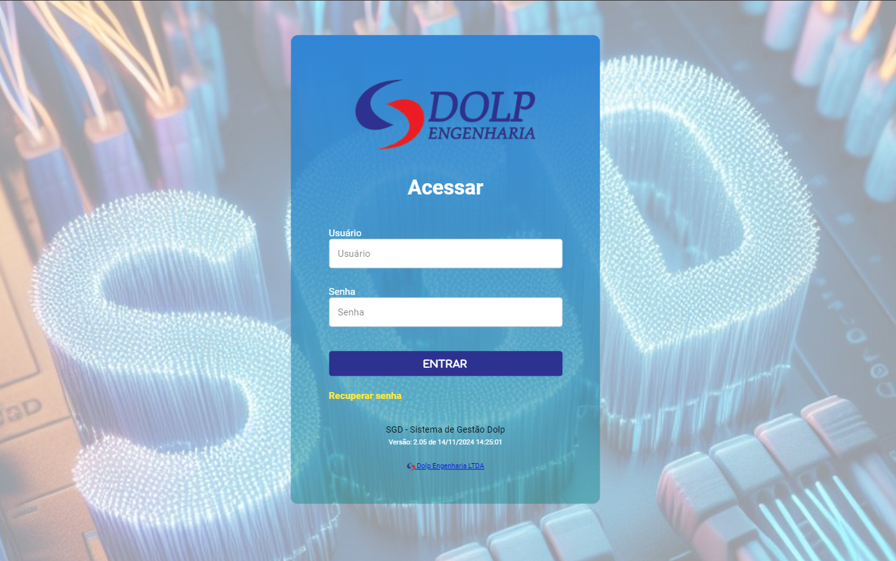

# SAIR 

- **Descrição** : Ao clicar no botão sair , o usuario será desconectado do sistema e sera redirecionado a tela de login do sistema.

  <label for="modal-toggle-15">
  
    </label>
    <input type="checkbox" id="modal-toggle-15" style="display:none;">
    

    <label for="modal-toggle-15" class="close">&times;</label>
    
    
