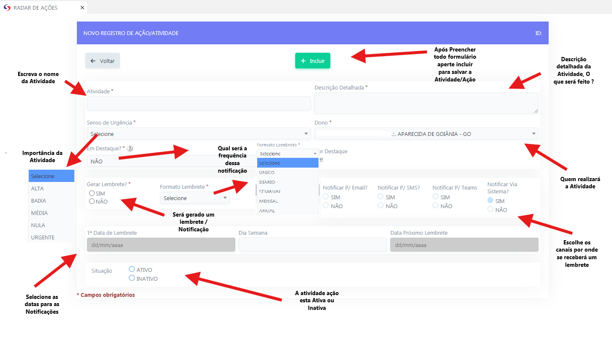
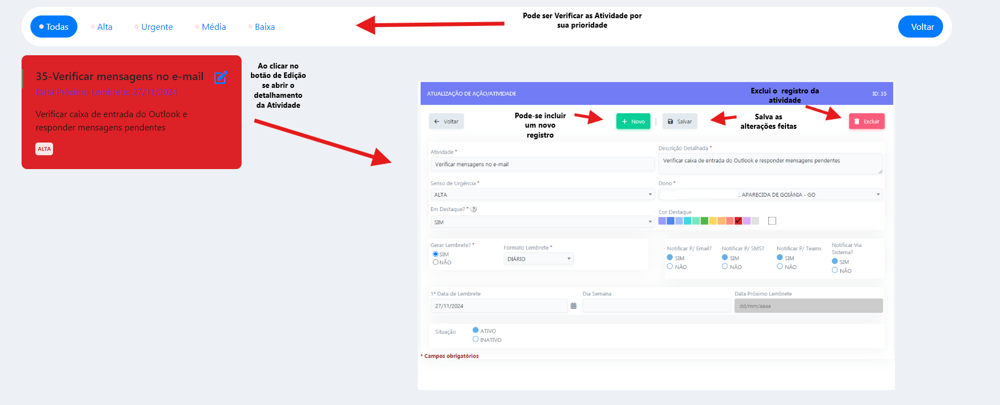
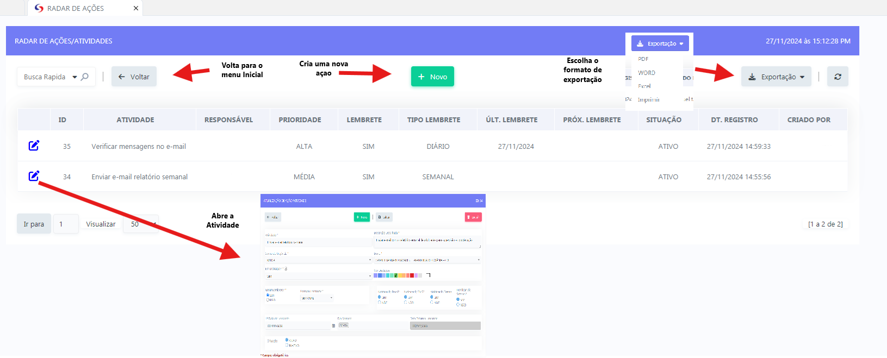
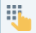
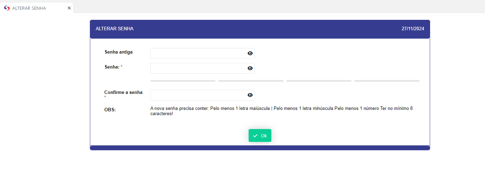
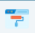
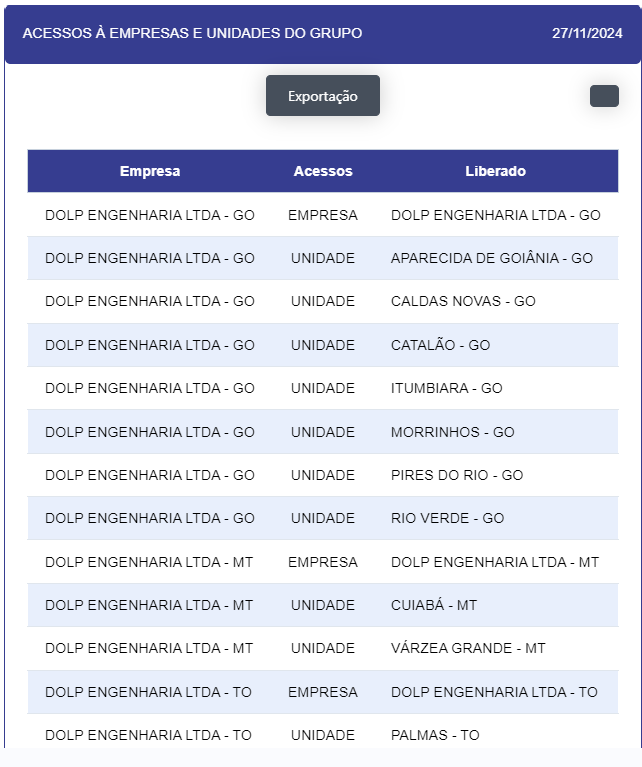

# SGD 

Menu de aplicações voltadas para usuário do SGD

 - ## RADAR DE AÇÕES  

    - **Descrição**: Aplicação de gerenciamento de tarefas e ações do usuário.

  <label for="modal-toggle-1">
  
  </label>
  <input type="checkbox" id="modal-toggle-1" style="display:none;">
  

  <label for="modal-toggle-1" class="close">&times;</label>
  
  

  
  - **Passo a Passo**: 

  - Ao abrir o botão "Nova Ação" - se abrirá um menu para criação de uma nova tarefa

  <label for="modal-toggle-2">
  
  </label>
  <input type="checkbox" id="modal-toggle-2" style="display:none;">
  

  <label for="modal-toggle-2" class="close">&times;</label>
  
  

  - Ao abrir o botão "Ações do Dia" - Se abrirá um relatório das atividades programadas para o Dia.

  <label for="modal-toggle-3">
  
  </label>
  <input type="checkbox" id="modal-toggle-3" style="display:none;">
  

  <label for="modal-toggle-3" class="close">&times;</label>
  
  

  - Ao abrir o botão "Minhas Ações" - Se abrirá um relatório de todas suas Atividades.

  <label for="modal-toggle-4">
  
  </label>
  <input type="checkbox" id="modal-toggle-4" style="display:none;">
  

  <label for="modal-toggle-4" class="close">&times;</label>
  
  

- ## ALTERAR SENHA 

    - **Descrição**: Abre uma aplicação para alteração da senha do usuário. 

     <label for="modal-toggle-5">
    
    </label>
    <input type="checkbox" id="modal-toggle-5" style="display:none;">
    

    <label for="modal-toggle-5" class="close">&times;</label>
    
    

- ## ALTERAR TEMA 

    - **Descrição**: Abre uma aplicação para modificação da visualização do tema do sistema

    <label for="modal-toggle-6">
    
    </label>
    <input type="checkbox" id="modal-toggle-6" style="display:none;">
    

    <label for="modal-toggle-6" class="close">&times;</label>
    
    

    
- **Passo a Passo**: 

- Selecione o tema desejado e aperte o botão "OK" e será atualizado o tema do sistema. 

- ## ASSINATURAS GERAIS 

    - **Descrição**: Abre um relatório das assinaturas pendentes.

    <label for="modal-toggle-7">
    
    </label>
    <input type="checkbox" id="modal-toggle-7" style="display:none;">
    

    <label for="modal-toggle-7" class="close">&times;</label>
    
    
 

    - **Passo a passo**: 

    - Ao clicar no botão" ASSINAR" se abre uma tela para a assinatura do Documento/Atividade.

    <label for="modal-toggle-8">
    
    </label>
    <input type="checkbox" id="modal-toggle-8" style="display:none;">
    

    <label for="modal-toggle-8" class="close">&times;</label>
    
    

    - Ao clicar no botão "INFORMAÇÕES" se abrirá uma tela mostrando os conteúdos da atividade.

    <label for="modal-toggle-9">
    
    </label>
    <input type="checkbox" id="modal-toggle-9" style="display:none;">
    

    <label for="modal-toggle-9" class="close">&times;</label>
    
    

- ## COLETAR BIOMETRIA 

  - **Descrição**: Aplicação para coleta da Biometria digital (Impressão digital) dos colaboradores.

  - **ATENÇÃO ESTA APLICAÇÃO ESTA RESTRITA SOMENTE A GRUPOS AUTORIZADOS**

   <label for="modal-toggle-10">
    
    </label>
    <input type="checkbox" id="modal-toggle-10" style="display:none;">
    

    <label for="modal-toggle-10" class="close">&times;</label>
    
    

- ## COLETAR BIOMETRIA FACIAL 

  - **Descrição**: Aplicação para coleta da Biometria facial dos colaboradores.

  - **ATENÇÃO ESTA APLICAÇÃO ESTA RESTRITA SOMENTE A GRUPOS AUTORIZADOS**
 <label for="modal-toggle-11">
    
    </label>
    <input type="checkbox" id="modal-toggle-11" style="display:none;">
    

    <label for="modal-toggle-11" class="close">&times;</label>
    
    

- ## BIOMETRIA 

  - **Descrição**: Aplicação que retorna o registro da biometria do usuário.
  
  <label for="modal-toggle-12">
    
    </label>
    <input type="checkbox" id="modal-toggle-12" style="display:none;">
    

    <label for="modal-toggle-12" class="close">&times;</label>
    
    

- ## MEUS ACESSOS 

 - **Descrição** : Aplicação que retorna os acessos dos usuários por empresa e unidade.

  <label for="modal-toggle-13">
    
    </label>
    <input type="checkbox" id="modal-toggle-13" style="display:none;">
    

    <label for="modal-toggle-13" class="close">&times;</label>
    
    

- ## PENDENCIAS 

 - **Descrição** : Retorna a página inicial onde se mostra as pendências que o usuário tem no sistema.

  <label for="modal-toggle-14">
  
    </label>
    <input type="checkbox" id="modal-toggle-14" style="display:none;">
    

    <label for="modal-toggle-14" class="close">&times;</label>
    
    

- **Passo a passo** : Ao clicar no ícone O usuário será redirecionado a aplicação na qual está sendo gerando a pendência.

- ## SAIR 

- **Descrição** : Ao clicar no botão sair , o usuario será desconectado do sistema e sera redirecionado a tela de login do sistema.

  <label for="modal-toggle-15">
  
    </label>
    <input type="checkbox" id="modal-toggle-15" style="display:none;">
    

    <label for="modal-toggle-15" class="close">&times;</label>
    
    

