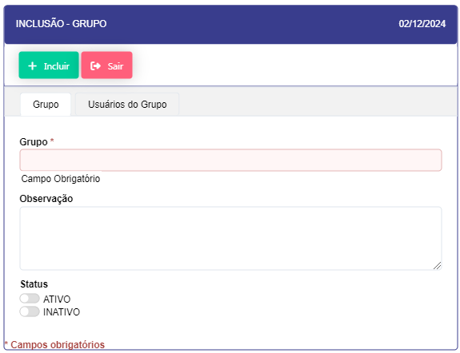
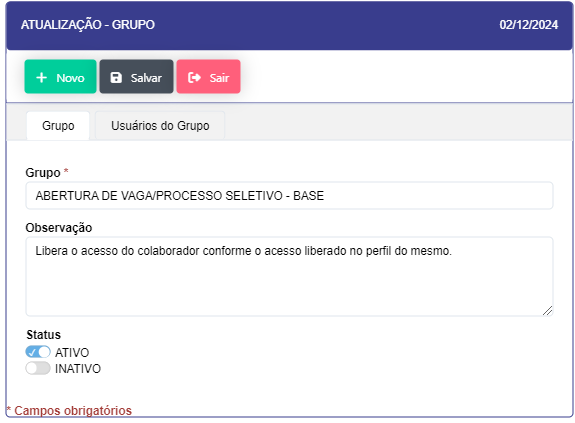
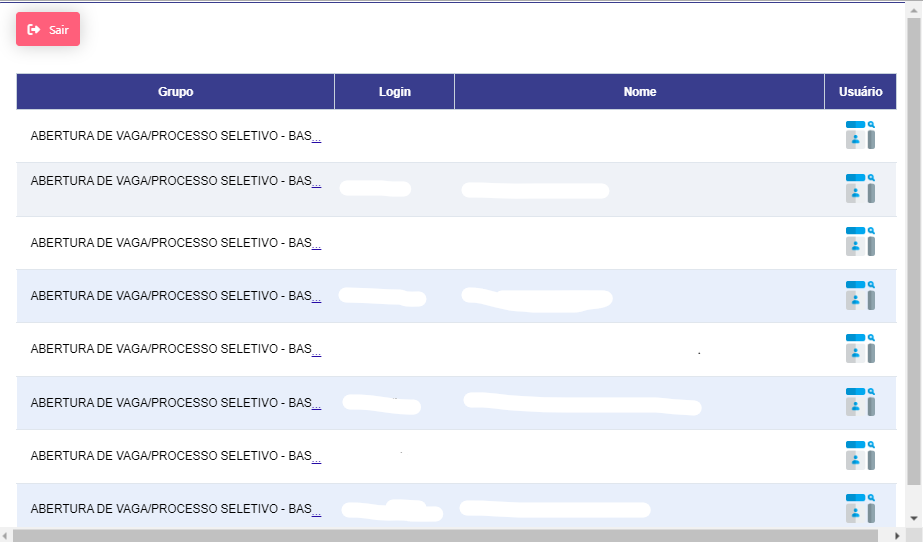

# Grupos de Usuários 
    
Os Grupos de Usuários definem níveis de acesso e permissões para conjuntos de usuários com responsabilidades semelhantes. Essa configuração permite que o administrador agrupe usuários de acordo com suas funções e simplifique o gerenciamento de permissões.

### Descrição dos Grupos

- **Descrição**: Cada grupo de usuários representa um conjunto de permissões padronizadas que podem ser aplicadas a múltiplos usuários, como equipes operacionais, administrativos, gerentes, entre outros.

- **Benefícios**: Facilita a aplicação e a manutenção das permissões ao longo do tempo, pois as alterações podem ser feitas diretamente no grupo e aplicadas a todos os membros automaticamente.

<label for="modal-toggle-14">

</label>
<input type="checkbox" id="modal-toggle-14" style="display:none;">

<label for="modal-toggle-14" class="close">&times;</label>

- **Passo a passo** : 

- Ao clicar no botão "NOVO" na parte superior se abrirá o modal para cadastro de um novo grupo de usuários. 

- Ao clicar no icone de "EDIÇÃO" a esquerda do Grupo ID se abre um modal para edição do grupo e aba para Inativar ou Atividar dicho grupo.

-  Ao clicar no icone  "USUÁRIOS" se abre um modal com o login e nome dos usuarios designados para o grupo.

- Ao cliclar no icone  "APLICAÇÕES" se abre um modal com as aplicações inclusas neste grupo.

