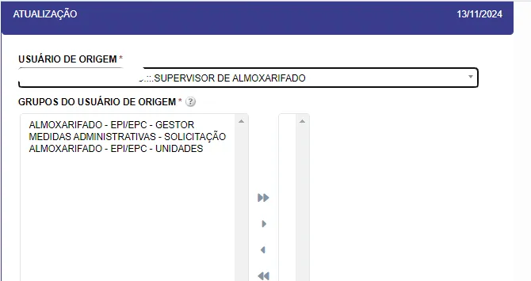
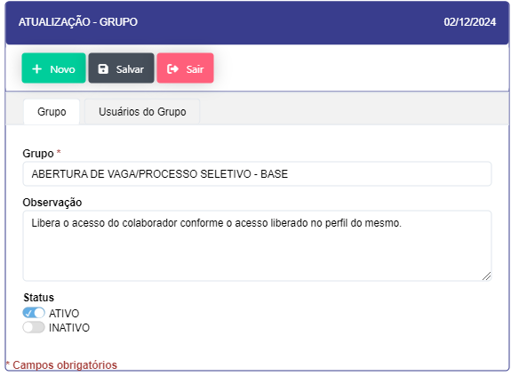
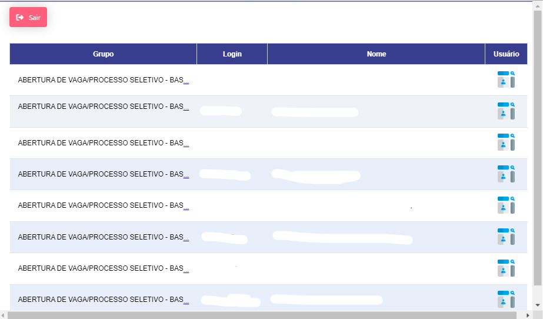
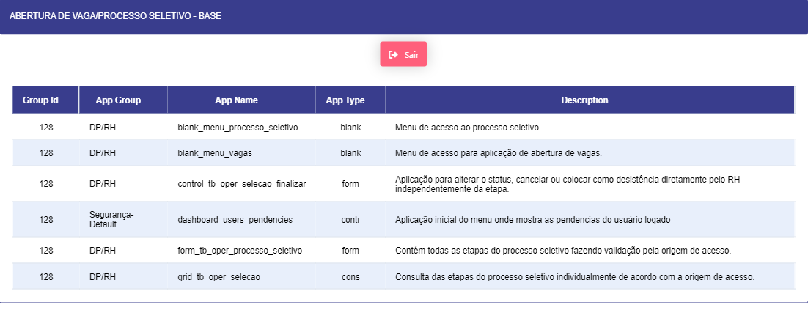

# 🛡️ Menu Segurança
---

## Cadastro de Usuários 

Esta seção orienta o administrador na criação, edição e gestão de usuários no sistema. Inclui as instruções detalhadas para cada passo:

- ### Inclusão :
    
    #### Inclusão de Novo Usuário
    
    - **Descrição**: Criação de um novo usuário, onde pode ser manual ou pelo processo de criação automática de um usuário quando ele é integrado ao treinamento.
    - **Passo a Passo**:
        - Vá até o botão "Novo".
        - Insira as informações do cadastro, caso ele seja feito manualmente ou somente valide caso venha da inclusão automática.
        - Clique em **"Incluir Novo Usuário"**.
        - O sistema automaticamente gerará o perfil do novo usuário com permissões básicas.
    - **Dicas**: Verifique se o usuário foi adicionado ao grupo correto, e revise suas permissões para garantir acesso aos recursos necessários.
   
    
    <label for="modal-toggle-1">
    
    </label>
    <input type="checkbox" id="modal-toggle-1" style="display:none;">
    

    <label for="modal-toggle-1" class="close">&times;</label>
    
    

- ### Edição - Nesta tela teremos a edição dos dados do colaborador, suas permissões de acesso e visualização no sistema

    - #### Edição de Dados do Colaborador
    
    - **Descrição**: Permite atualizar dados, permissões e áreas de visualização de um colaborador existente.

    - **Passo a Passo**:

        - Acesse "Cadastro de Usuários" > "Editar".

        - Selecione o colaborador que deseja editar.

        - Modifique os campos necessários, como unidades e empresas acessíveis.

        - Clique em "Salvar" para aplicar as alterações.

    - **Nota**: Esta funcionalidade é útil para atualizações de dados do usuário, unidade de acesso e liberação, ou ajuste de acessos por parte dos administradores.
    
    
    <label for="modal-toggle-2">
    
    </label>
    <input type="checkbox" id="modal-toggle-2" style="display:none;">
    

    <label for="modal-toggle-2" class="close">&times;</label>
    
    

    
    - **Perfil do Usuário**
        - **Descrição**: Configuração e liberação de aplicações e permissões.
        - **Passo a Passo**:
            - No perfil do usuário, selecione as **aplicações** que ele terá acesso.
            - Defina o **nível de acesso** (visualização, edição ou administração).
        
    <label for="modal-toggle-3">
    
    </label>
    <input type="checkbox" id="modal-toggle-3" style="display:none;">
    

    <label for="modal-toggle-3" class="close">&times;</label>
    
    

        
    - **Unidades de Acesso e Empresas**
        - **Descrição**: Especifica as unidades e empresas acessíveis ao usuário.
        - **Passo a Passo**:
            - Em "Unidades de Acesso", selecione a unidade desejada.
            - Em "Empresas", defina as empresas que o usuário pode visualizar.
            
            **Unidades de Acesso :**
            
            <label for="modal-toggle-4">
            
            </label>
            <input type="checkbox" id="modal-toggle-4" style="display:none;">
            

            <label for="modal-toggle-4" class="close">&times;</label>
            
            

            
            **Empresas :**

            <label for ="modal-toggle-5">
            
            </label>
            <input type="checkbox" id="modal-toggle-5" style="display:none;">
            

            <label for="modal-toggle-5" class="close">&times;</label>
            
            

            
    - **Assinatura :  Mostra a Assinatura digital do usuário e data e hora de sua inclusão**
        
        <label for ="modal-toggle-6">
        
        </label>
        <input type="checkbox" id="modal-toggle-6" style="display:none;">
        

        <label for="modal-toggle-6" class="close">&times;</label>
        
        

        
    - **Biometria :** Fica registrada informações sobre a assinatura biométrica do colaborador
        
        <label for ="modal-toggle-7">
        
        </label>
        <input type="checkbox" id="modal-toggle-7" style="display:none;">
        

        <label for="modal-toggle-7" class="close">&times;</label>
        
        

        
- **Botões Auxiliares - Temos 4 botões na parte de baixo da tela onde temos 4 Aplicações ( Liberações , Resetar Assinatura . Assinaturas Pendentes , Copiar Permissões )**
        <label for ="modal-toggle-8">
        
        </label>
        <input type="checkbox" id="modal-toggle-8" style="display:none;">
        

        <label for="modal-toggle-8" class="close">&times;</label>
        
        

    - **Liberações**

        - **Descrição**: Permite visualizar o histórico de permissões e ajustes de acesso de um usuário.

        - **Uso**: Clicar neste botão exibe uma lista detalhada das permissões e liberações de acesso concedidas ao usuário, útil para auditorias de segurança.

        <label for="modal-toggle-9">
        
        </label>
        <input type="checkbox" id="modal-toggle-9" style="display:none;">
        

        <label for="modal-toggle-9" class="close">&times;</label>
        
        

    Exibe o histórico de liberações de acesso e permissões do usuário. 

    - **Resetar Assinatura**

        - **Descrição**: Opção para redefinir a senha de um usuário.

        - **Uso**: Clique em "Resetar Assinatura" para enviar uma nova senha ao colaborador.

        <label for="modal-toggle-10">
        
        </label>
        <input type="checkbox" id="modal-toggle-10" style="display:none;">
        

        <label for="modal-toggle-10" class="close">&times;</label>
        
        

    
    Reseta a senha de acesso do usuário ao Sistema

    - **Assinaturas Pendentes**

        - **Descrição**: Lista as assinaturas digitais pendentes de cada usuário.

        - **Uso**: Este botão exibe um painel com todas as assinaturas ainda não completadas, garantindo que todas estejam atualizadas.

           <label for ="modal-toggle-11">
            
            </label>
            <input type="checkbox" id="modal-toggle-11" style="display:none;">
            

            <label for="modal-toggle-11" class="close">&times;</label>
            
            

    
    Exibe as Assinaturas pendentes destinadas ao Usuário 

    - **Copiar Permissões**

        - **Descrição**: Copia as permissões de um usuário para outro.

        - **Passo a Passo**:

            - Acesse "Copiar Permissões".

            - Selecione o usuário de origem.

            - Escolha o usuário de destino para replicar as permissões.

        <label for="modal-toggle-12">
        
        </label>
        <input type="checkbox" id="modal-toggle-12" style="display:none;">
        

        <label for="modal-toggle-12" class="close">&times;</label>
        
        

    
    Copia as permissões designadas a um outro usuário 

    - **Dica**: Útil ao adicionar novos colaboradores que precisam das mesmas permissões de um usuário já existente.
     
    <label for="modal-toggle-12">
    
    </label>
    <input type="checkbox" id="modal-toggle-12" style="display:none;">
    

    <label for="modal-toggle-12" class="close">&times;</label>
    
    

    
    Copia as permissões designadas a um outro usuário 
    
---

## Grupos de Usuários 
    
Os Grupos de Usuários definem níveis de acesso e permissões para conjuntos de usuários com responsabilidades semelhantes. Essa configuração permite que o administrador agrupe usuários de acordo com suas funções e simplifique o gerenciamento de permissões.
    
### Descrição dos Grupos

- **Explicação**: Cada grupo de usuários representa um conjunto de permissões padronizadas que podem ser aplicadas a múltiplos usuários, como equipes operacionais, administrativos, gerentes, entre outros.

- **Benefícios**: Facilita a aplicação e a manutenção das permissões ao longo do tempo, pois as alterações podem ser feitas diretamente no grupo e aplicadas a todos os membros automaticamente.

<label for="modal-toggle-14">

</label>
<input type="checkbox" id="modal-toggle-14" style="display:none;">

<label for="modal-toggle-14" class="close">&times;</label>

<label for="modal-toggle-15">

- **Passo a passo** : 

- Ao clicar no botão "NOVO" na parte superior se abrirá o modal para cadastro de um novo grupo de usuários. 

- Ao clicar no ícone de "EDIÇÃO" à esquerda do Grupo ID se abre um modal para edição do grupo e aba para Inativar ou Ativar dito grupo.

-  Ao clicar no ícone "USUÁRIOS" se abre um modal com o login e nome dos usuários designados para o grupo.

- Ao clicar no ícone "APLICAÇÕES" se abre um modal com as aplicações inclusas neste grupo.

---

## Aplicações 
    
As aplicações são cadastradas no sistema para que possam ser definidos seus grupos, o tipo de aplicativo como Blank (página html), Cons (Consulta / grid), form (formulário), contr (Aplicação de controle).
    
- **Descrição**: As aplicações são módulos específicos dentro do sistema, como formulários, grids e páginas de controle, onde podem ser definidas permissões de acesso.

- **Passo a Passo**:

    - **Novo Cadastro**: Clique em “Novo” para adicionar uma aplicação ao sistema.

    - **Edição de Aplicações**: Clique em “Editar” para configurar as permissões e designar o grupo de usuários que pode acessar a aplicação.

    - **Consulta**: Use o filtro para localizar rapidamente uma aplicação específica.

<label for="modal-toggle-16">

</label>
<input type="checkbox" id="modal-toggle-16" style="display:none;">

<label for="modal-toggle-16" class="close">&times;</label>

<label for="modal-toggle-17">

</label>
<input type="checkbox" id="modal-toggle-17" style="display:none;">

<label for="modal-toggle-17" class="close">&times;</label>

---

## Grupo de aplicações 

    
Os grupos de aplicações criam grupos para organizar as aplicações por grupo de afinidade e propósito.
    
- **Descrição**: Os grupos de aplicações permitem organizar as aplicações por propósito, facilitando a gestão e a configuração de acessos para grupos específicos de usuários.

- **Passo a Passo**:

    - Acesse o botão “Novo” para criar um grupo de aplicações.

    - Nomeie o grupo conforme a afinidade das aplicações (ex.: Relatórios, Monitoramento).

- **Dica**: Manter as aplicações agrupadas é útil para organizações com módulos extensos e facilita a liberação de acessos para novos usuários.

<label for="modal-toggle-19">

</label>
<input type="checkbox" id="modal-toggle-19" style="display:none;">

<label for="modal-toggle-19" class="close">&times;</label>

<label for="modal-toggle-20">

</label>
<input type="checkbox" id="modal-toggle-20" style="display:none;">

<label for="modal-toggle-20" class="close">&times;</label>

---

## Usuários para grupo 

- **Descrição :** Retorna os usuários cadastrados em cada grupo de usuários

- **Passo a passo :**

    - Acesse o filtro onde será inserido o nome do grupo a ser consultado.

    - Será exibido os usuários presentes no grupo
    
<label for="modal-toggle-22">

</label>
<input type="checkbox" id="modal-toggle-22" style="display:none;">

<label for="modal-toggle-22" class="close">&times;</label>

---

## Aplicações para Grupo 

- **Descrição :** Aqui são designadas as aplicações para os grupos de Usuário, nesta aplicação se pode dar e retirar acesso e restringir permissões do grupo nas aplicações

- **Passo a passo :**

    - Acesse o Filtro e preencha os campos

        - “Nome do Grupo de Usuários

        - “Se o grupo possui acesso ou não à Aplicação”

        - “Grupo da Aplicação “

        - “Aplicação “

        - “Aplicação Geral (Caso seja uma aplicação Pai)”
        
<label for="modal-toggle-24">

</label>
<input type="checkbox" id="modal-toggle-24" style="display:none;">

<label for="modal-toggle-24" class="close">&times;</label>

    
<label for="modal-toggle-25">

</label>
<input type="checkbox" id="modal-toggle-25" style="display:none;">

<label for="modal-toggle-25" class="close">&times;</label>

    
---

## Regras de Negócios  
    
Regras de Negócios são regras específicas configuradas para controlar o acesso e as ações de diferentes usuários com base em critérios definidos, como função, departamento ou grupo de acesso.
    
- **Descrição**: Define regras de negócios específicas para usuários, facilitando o controle de permissões e o cumprimento de políticas de segurança do sistema.

- **Passo a Passo**:

    - Clique em "Incluir" para adicionar uma nova regra de negócio.

    - Preencha os parâmetros necessários:

        - **Pergunta**: Especifique o cenário da regra, como "Quem pode editar estoque no Almoxarifado?"

        - **Tipo de Validação**: Escolha o critério de validação, como Usuário, Função, Departamento.

        - **Aplicações e Responsáveis**: Associe a regra às aplicações pertinentes e identifique os responsáveis.

        - **Observações**: Inclua notas adicionais, se necessário.

<label for="modal-toggle-27">

</label>
<input type="checkbox" id="modal-toggle-27" style="display:none;">

<label for="modal-toggle-27" class="close">&times;</label>

    

---

## Apps x Permissões 

- **Descrição :** Consulta generalizada que traz as informações sobre os grupos de aplicações, nome da aplicação e grupo de usuário

- **Passo a Passo :** Acesse o filtro e insira as informações a serem consultadas

<label for="modal-toggle-29">

</label>
<input type="checkbox" id="modal-toggle-29" style="display:none;">

<label for="modal-toggle-29" class="close">&times;</label>

---
## Envio E-mail 

- **Descrição :** A aplicação é um sub-menu onde se deriva em 3 aplicações sendo elas :

### Contas de E-mail 

- **Descrição**:  os cadastros dos usuários e os grupos para envio de e-mail

- **Passo a passo** :

- Acesse o botão “Novo” e preencha o formulário com os dados para configuração do envio do e-mail através do sistema

<label for="modal-toggle-32">

</label>
<input type="checkbox" id="modal-toggle-32" style="display:none;">

<label for="modal-toggle-32" class="close">&times;</label>

- Acesse o botão “Editar” e preencha o formulário com os dados para configuração do envio do e-mail através do sistema

<label for="modal-toggle-33">

</label>
<input type="checkbox" id="modal-toggle-33" style="display:none;">

<label for="modal-toggle-33" class="close">&times;</label>

<label for="modal-toggle-34">

</label>
<input type="checkbox" id="modal-toggle-34" style="display:none;">

<label for="modal-toggle-34" class="close">&times;</label>

        

### Tipos de Notificação: 

- **Descrição :**  Criar o tipo de notificação e seu conteúdo que pode ser utilizado na configuração das contas de e-mail

- **Passo a passo :**

- Acesse o botão “Novo” onde será configurado, notificação, descrição e perfis de e-mail usados

- Acesse o botão editar para editar os registros já configurados.

<label for="modal-toggle-36">

</label>
<input type="checkbox" id="modal-toggle-36" style="display:none;">

<label for="modal-toggle-36" class="close">&times;</label>

        
<label for="modal-toggle-37">

</label>
<input type="checkbox" id="modal-toggle-37" style="display:none;">

<label for="modal-toggle-37" class="close">&times;</label>

<label for="modal-toggle-38">

</label>
<input type="checkbox" id="modal-toggle-38" style="display:none;">

<label for="modal-toggle-38" class="close">&times;</label>

        

### Pessoas por notificação 

- **Descrição :** gerencia as pessoas que irão receber os e-mails pelo tipo de notificação cadastradas

- **Passo a passo :**  clique no ícone de pessoas onde será aberto um formulário para inserção das pessoas pelo tipo de notificação

<label for="modal-toggle-40">

</label>
<input type="checkbox" id="modal-toggle-40" style="display:none;">

<label for="modal-toggle-40" class="close">&times;</label>

<label for="modal-toggle-41">        

</label>
<input type="checkbox" id="modal-toggle-41" style="display:none;">

<label for="modal-toggle-41"class="close">&times;</label>

---

## Usuários logados 

- **Descrição** : Aplicação que retorna os registros de login dentro do sistema

<label for="modal-toggle-43">

</label>
<input type="checkbox" id="modal-toggle-43" style="display:none;">

<label for="modal-toggle-43" class="close">&times;</label>

---

## Log do Sistema 

- **Descrição** : Retorna os logs do sistema, que podem ser consultados por vários parâmetros.

<label for="modal-toggle-45">

</label>
<input type="checkbox" id="modal-toggle-45" style="display:none;">

<label for="modal-toggle-45" class="close">&times;</label>

    

---

## Alterar a Senha 

**Descrição :** Realiza a alteração de senha do próprio usuário 

<label for="modal-toggle-47">

</label>
<input type="checkbox" id="modal-toggle-47" style="display:none;">

<label for="modal-toggle-47" class="close">&times;</label>

    
--- 

## Versionamento 
    
**Descrição :** Sub-menu onde se registra as alterações no sistema

### Registrar Alterações 

- **Descrição :** Realiza o versionamento dos chamados

- **Passo a passo :**

- Clique no botão Versionar onde se abrirá o formulário para registros das alterações nas aplicações do chamado aberto

<label for="modal-toggle-50">

</label>
<input type="checkbox" id="modal-toggle-50" style="display:none;">

<label for="modal-toggle-50" class="close">&times;</label>

<label for="modal-toggle-51">

</label>
<input type="checkbox" id="modal-toggle-51" style="display:none;">

<label for="modal-toggle-51" class="close">&times;</label>

        
### Versionar 

- **Descrição** : Versiona todo o sistema e uma nova versão

<label for="modal-toggle-53">

</label>
<input type="checkbox" id="modal-toggle-53" style="display:none;">

<label for="modal-toggle-53" class="close">&times;</label>

### Histórico de Versões** 

- **Descrição :**  Verifica os versionamentos realizados em cada aplicação ou tabela

<label for="modal-toggle-55">

</label>
<input type="checkbox" id="modal-toggle-55" style="display:none;">

<label for="modal-toggle-55" class="close">&times;</label>

--- 
## SMS 
    
**Descrição** : API que realiza o envio de SMS via sistema seja de notificação ou de reset de Senhas - Retorna um Gráfico com o resumo total de envio de SMS. 

<label for="modal-toggle-57">

</label>
<input type="checkbox" id="modal-toggle-57" style="display:none;">

<label for="modal-toggle-57" class="close">&times;</label>

    
---