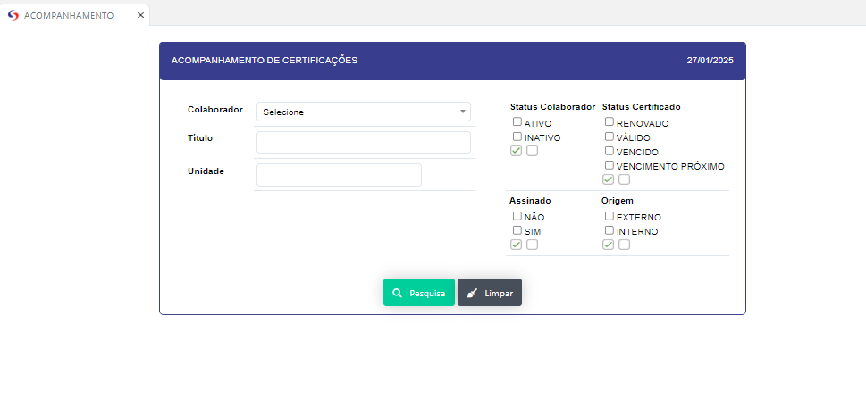
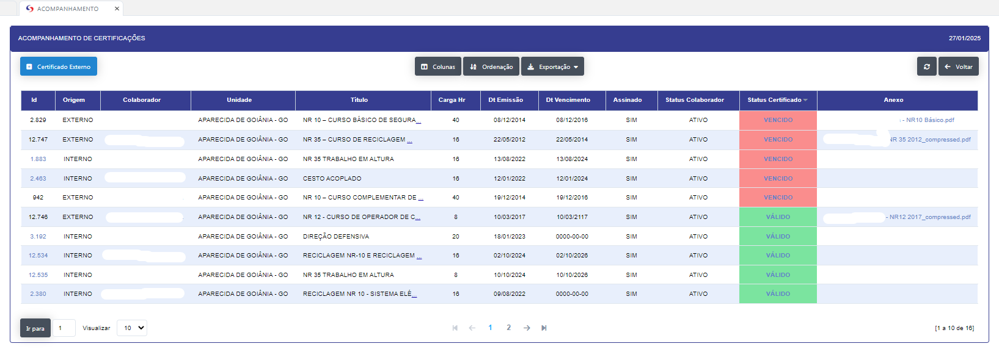

#  Acompanhamento 

Aplicação que realiza a validade das certificações dos participantes , onde é possível verificar a validade das certificações e realizar a renovação das mesmas.

Ao clicar no botão + Certificação Extrena , é possível adicionar uma nova certificação externa  para o participante pois se abre um modal para cadastro.

