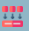
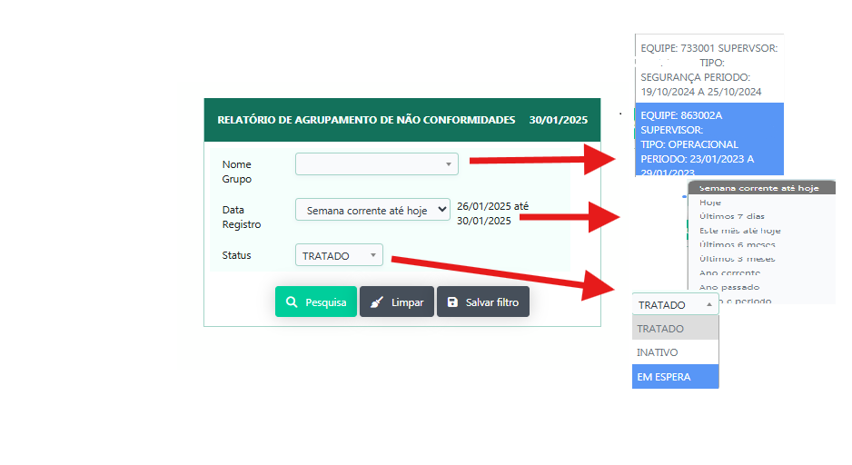
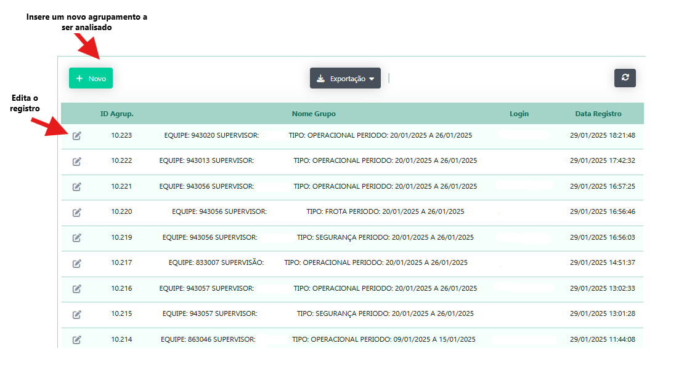
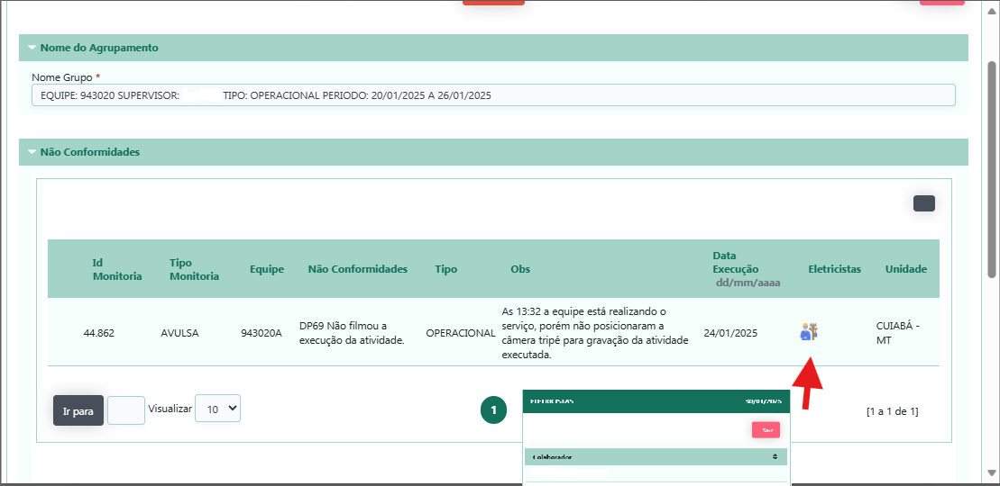
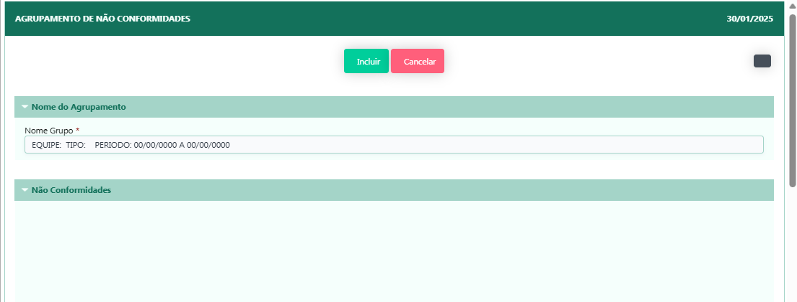

# Agrupar Monitoria 

Aplicação que retorna a busca das não conformidade de uma equipe em um espaço de tempo(semana de trabalho).

Aplicação abre em forma de filtro para passagem dos parametros e busca dos agrupamentos de analise 

Ao clicar no icone de edição se abre um modal com as NC analisadas por agupamento 

