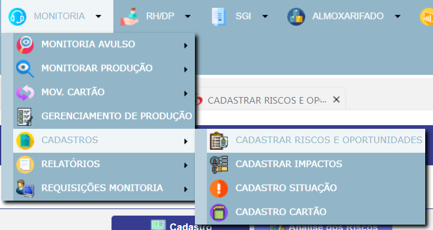
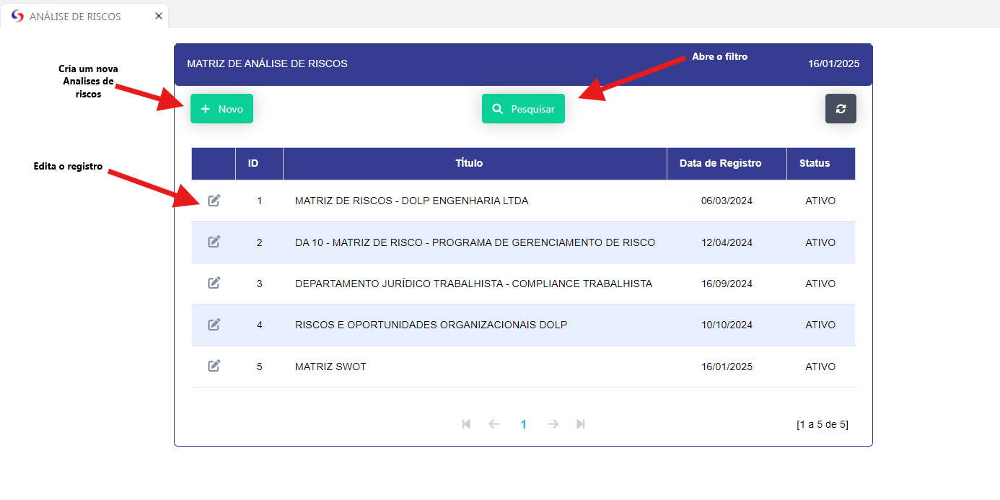
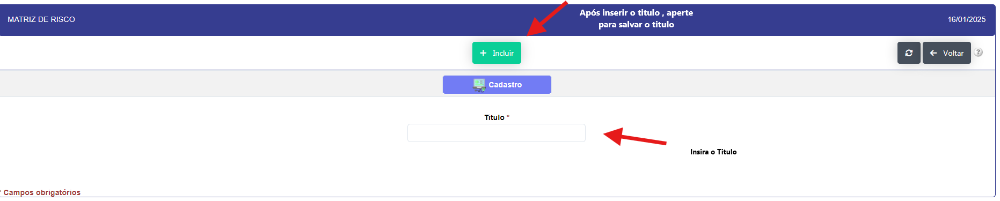
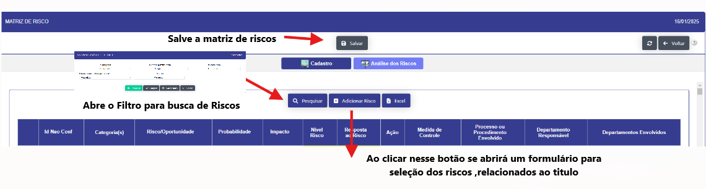
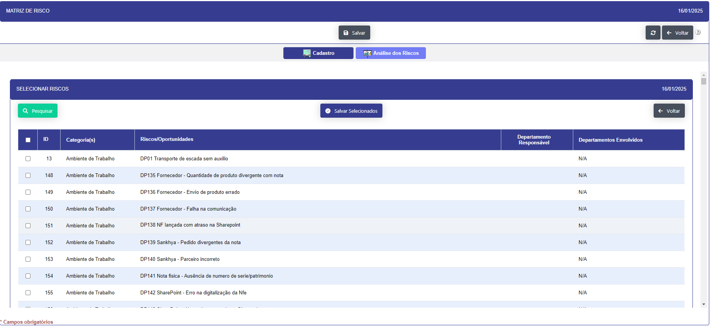
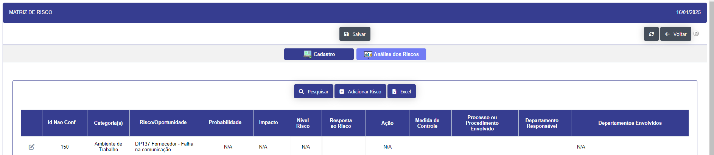
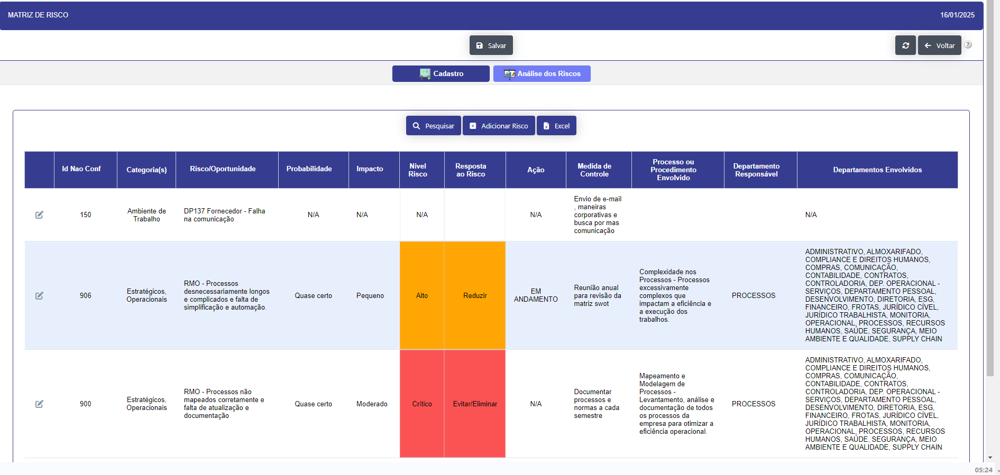

# Analise de Riscos 

- **Descrição** : Aplicação destinada a orientar os departamentos junto com o time de complice ,onde se registra os riscos identificados e suas respectivas medidas de mitigação e tratamentos, e realiza os calculos dos riscos atraves dos riscos ou oportunidades (anteriormente chamados de NC). Os mesmo são cadastradps no menu da Monitoria.

A tela inicia da Matriz de analise de riscos 

- **Passo a Passo** :

- Ao clicar no botão " + NOVO", se abre um formulário para cadastrar um titulo.

- Após incluir o titulo se abre uma nova aba no formulário para incluir os riscos já cadastrados. 

- Após a inserção dos requisitos os mesmo serão retornados na tela para que possa ser realizados os calculos de riscos.

Ao clicar no icone de edição , abre um modal para realizar os calculos de riscos.

Após salvar o calculos de riscos, o mesmo é retornado na tela com os resultados.

