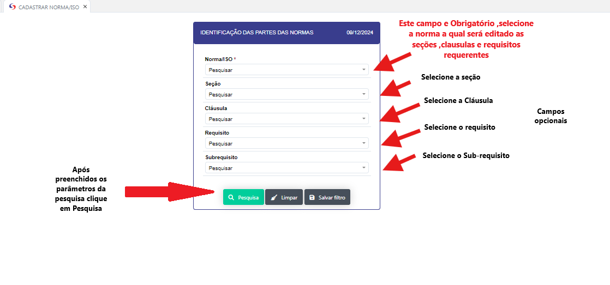
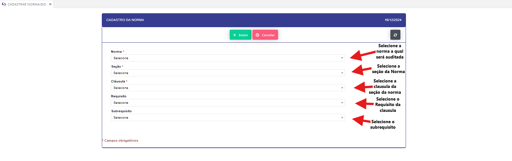
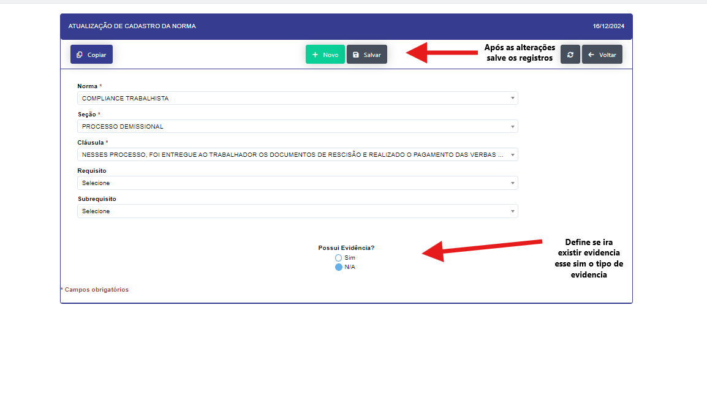
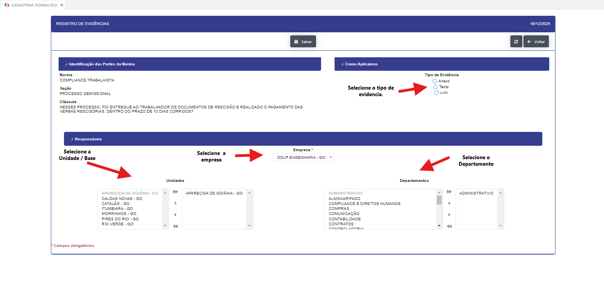
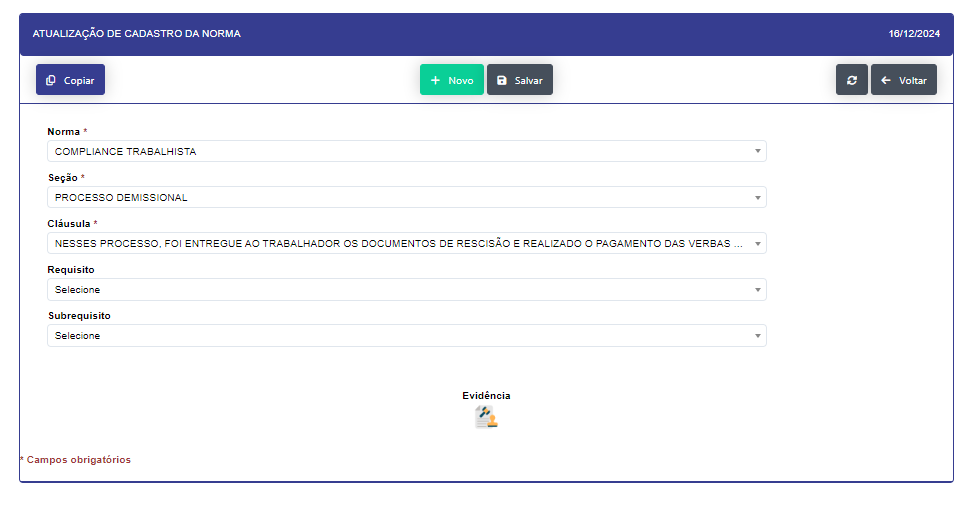

## Cadastrar Norma/Iso 

- **Descrição**: Realiza o cadastro das normas e isos da empresa.
Aplicação abre em filtro para pesquisa de normas e isos.

- **Passo a Passo** :

- Ao preencher os paramentros da pesquisa se abrirá a tela de cadastro da norma ou iso.

   
 - Ao clicar no botão novo, podera realizar o cadastro de uma seção ou parte da norma/iso a ser auditada.

   

 - Ao clicar no icone de edição , podera realizar as alterações necessárias na seção ou parte da norma/iso
   
   

 - Se possuir evidencia ao salvar a seção ou parte da norma/iso, se abrirá um modal para o cadastro da mesma 

   

 - Apos incluir o registro da Evidencia , precione o botão voltar e retorne a parte anterior.

   

 - Assim aparecerá o icone de evidencia ao clicar sobre o mesmo poderá visualizar ou editar a evidencia.