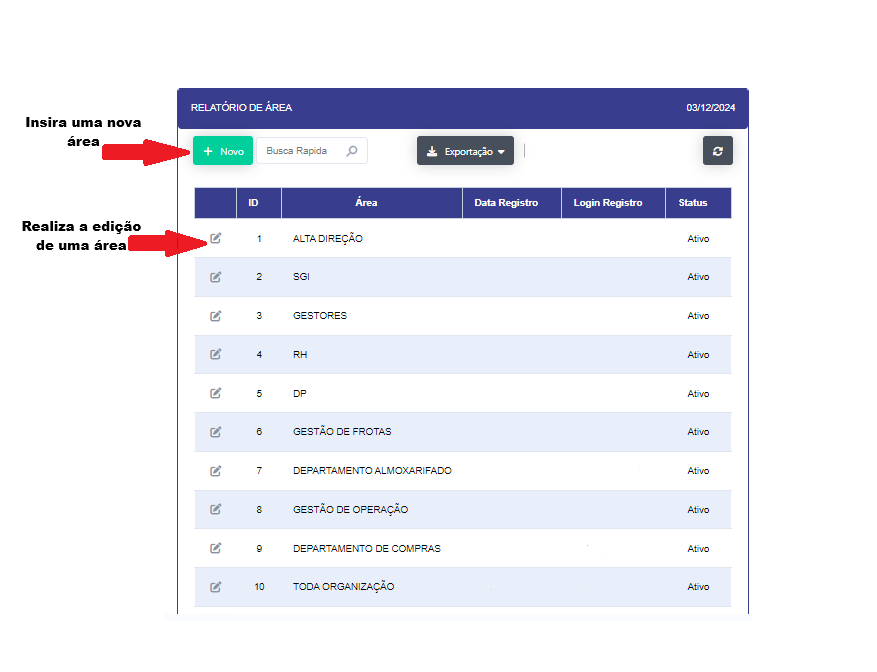
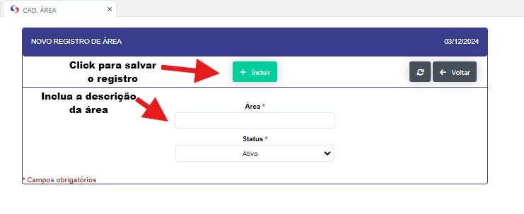
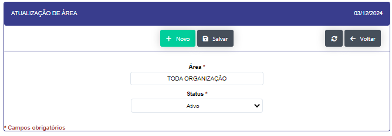

### Cadastro de Área 

- **Descrição** : Aplicação para cadastro e edição das áreas de atuação e disponilibilidade da informação.(Departamento)

- **Passo a passo** : 

- Ao clicar no botão "NOVO" se abrirá uma nova tela para que se possa se realizado o novo registro.

- Prencha os campos solicitados e clique no botão "INCLUIR"

- Ao clicar no icone de edição se abrirá uma nova tela para que se modificar um um registro já realizado. 

