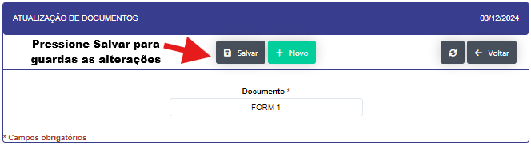

## Cadastro de documentos 

- **Descrição** Aplicação para cadastro e edição dos nomes do documentos/procedimentos

- Ao clicar no botão "NOVO" se abrirá uma nova tela para que se possa se realizado o novo registro.

- Prencha os campos solicitados e clique no botão "INCLUIR" para realizar

- Ao clicar no icone de edição se abrirá uma nova tela para que se possa realizar a edição do documento.

