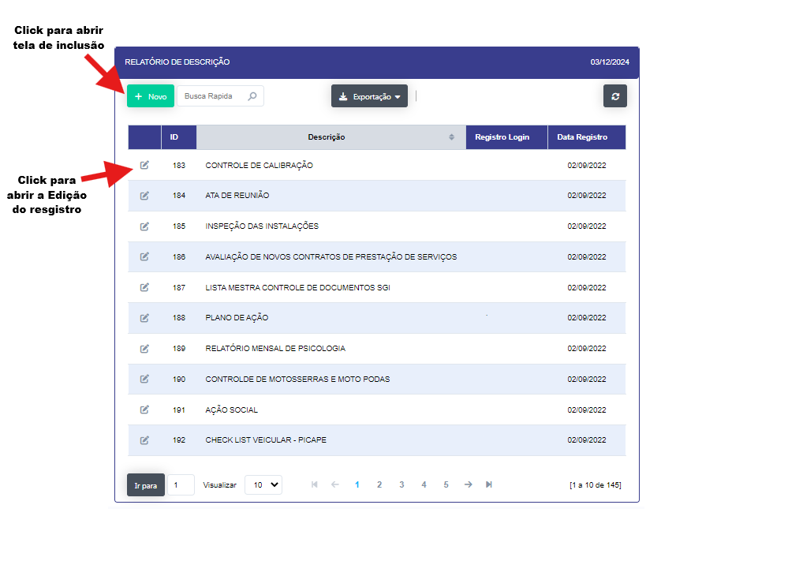
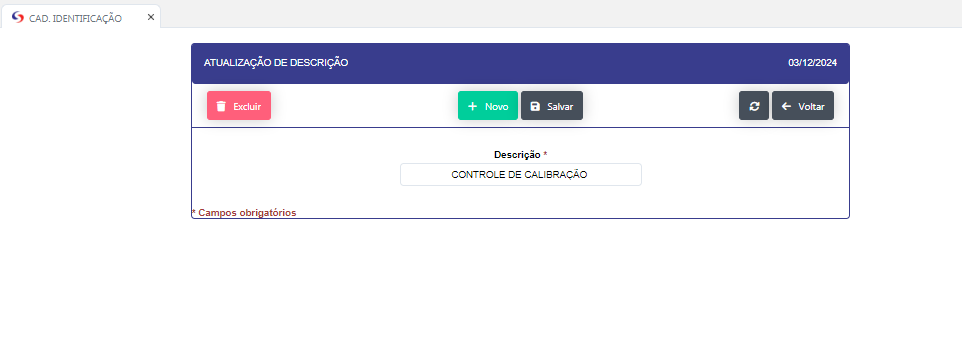

## Cadastro de Identificação 

- **Descrição** : Aplicação para cadastro e edição das identificações dos documento (Descrição). 

- **Passo a passo** : 

- Ao clicar no botão "NOVO" se abrirá uma nova tela para que se possa se realizado o novo registro

- Ao clicar no icone de edição se abrirá uma nova tela para que se possa realizar a edição do registro.

