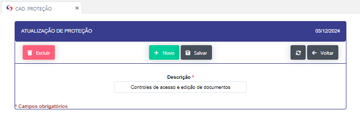

 ## Cadastro de Proteção  

- **Descrição** : Aplicação para cadastro e edição das proteções dos documentos (Descrição), Departamento ou setor responsavel e seu respectivo nivel de acesso. 

- **Passo a passo** :

- Ao clicar no botão "NOVO" se abrirá uma nova tela para que se possa se realizado o novo registro

- Ao clicar no icone de edição se abrirá uma nova tela para que se possa realizar a edição do registro.

- Aqui se pode excluir ou editar ou registros. 