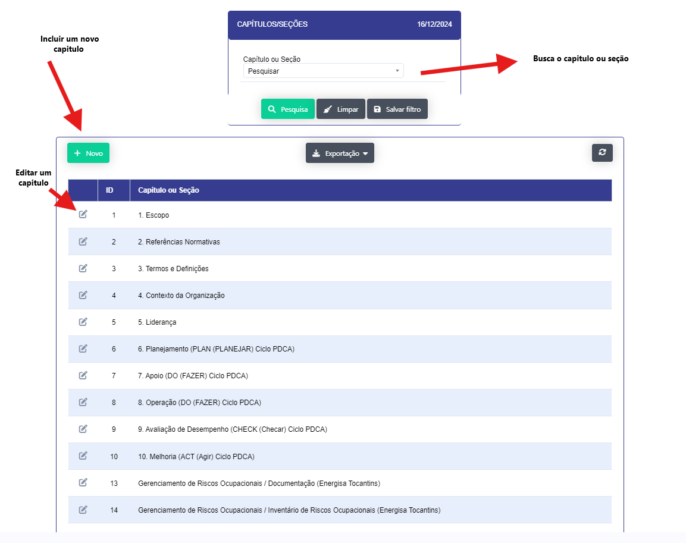
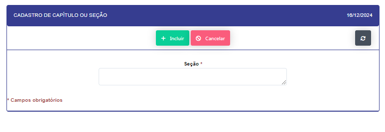
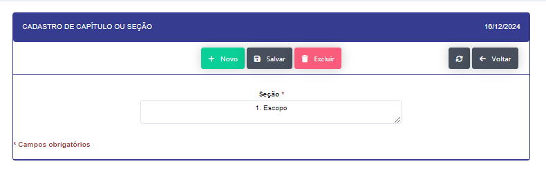

## Capítulo/Seção 

- **Descrição**: Realiza o cadastro dos capítulos e seções.

- **Passo a Passo** : 

- Ao clicar no botão novo se abrirá um modal para um cadastro de um nova capitulo ou seção.

- Ao clicar no icone de edição , podera realizar as alterações necessárias no capitulo 
ou seção.

