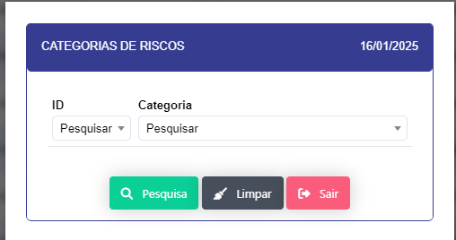

# Categorias 

Formulario para cadastrar categorias de riscos e oportunidades.

- Ao clicar no botão novo se abre um modal para cadastro de uma nova categoria.

- Ao clicar no botão salvar, a categoria é cadastrada e retornado na tela.

- Ao clica no botão Pesquisar abre um modal com o filtro para pesquisar categorias.

- Ao clicar no icone de edição abre um modal para editar a categoria.

