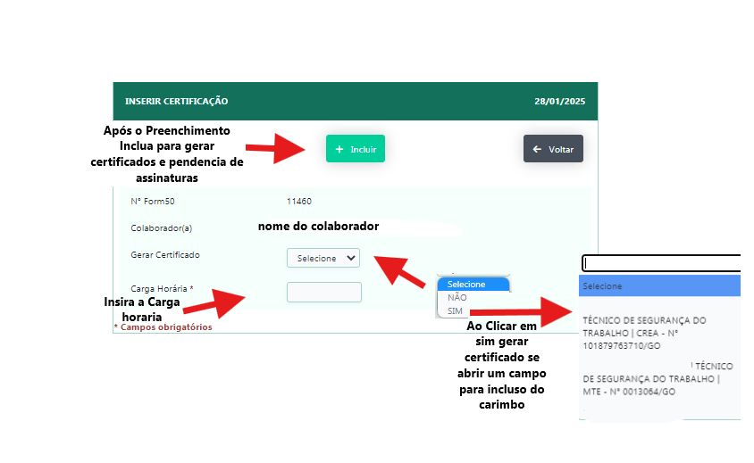

# Certificado por Participante 

 Aplicação para Emissão e consulta de certificado por participante 

 

  **Descrição**: Aplicação abre em forma de filtro com seguintes campos :

  - Nº form50 (ID do treinamento)

  - Base/Unidade (Base/Unidade do treinamento)

  - Participante (Nome do participante)

  - Titulo (Título do certificado)

  - Status Colaborador (Status do colaborador) Ativo / Inativo

  - Assinado (Assinado pelo colaborador/ Treinamento)

  - Existe Certificado (Existe certificado para o participante)
 
  **Observação** :

 - Caso não exista o certificado , se abrirá um formulario onde e possivel incluir o certificado do participante. 

 

 

 - Caso o participante já tenha o certificado , se abirá uma grid de certificados do participante, verificando se o mesmo já foi assinado ou não 

 

 

 

 -  As assinaturas pendentes serão acessadas via o menu de assinaturas gerais no meu de usuario 

 
