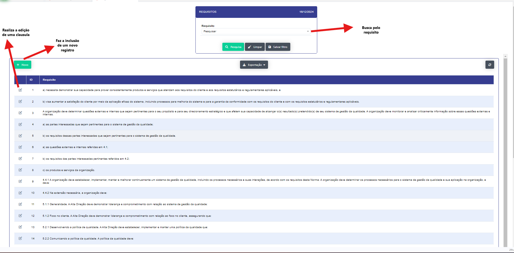
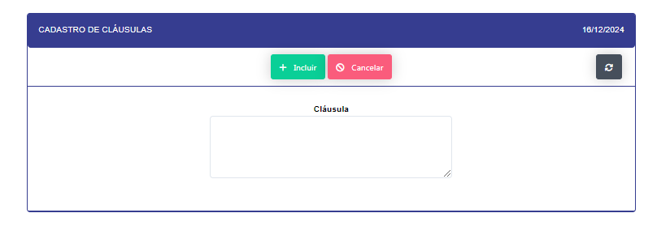
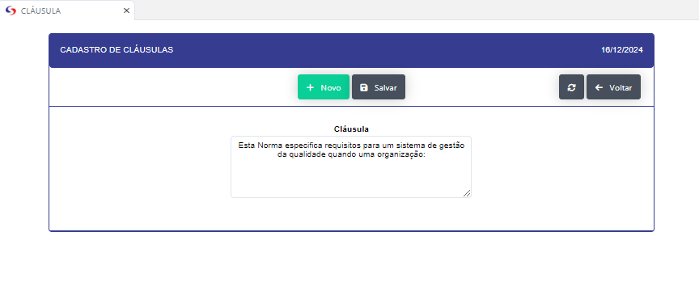

## Clásula 

- **Descrição** : Realiza o cadastro das clausulas

- **Passo a Passo** : 

- Ao clicar no botão novo se abrirá um modal para um cadastro de um nova clausula.

- Ao clicar no icone de edição se abrirá um modal para edição de um clausula.

