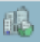
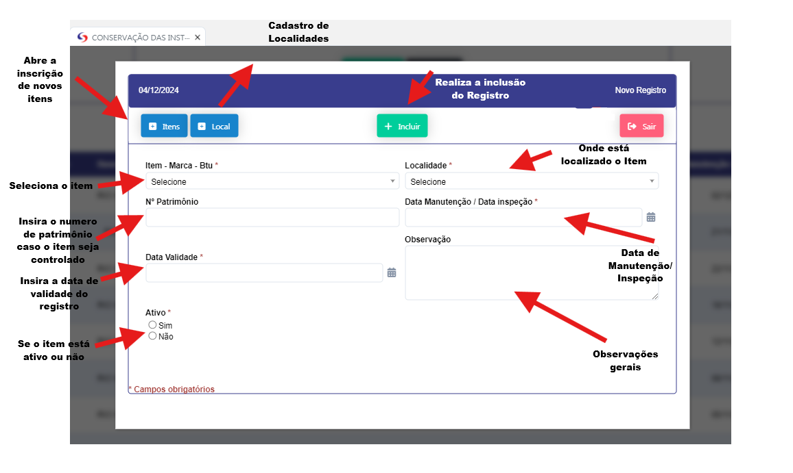
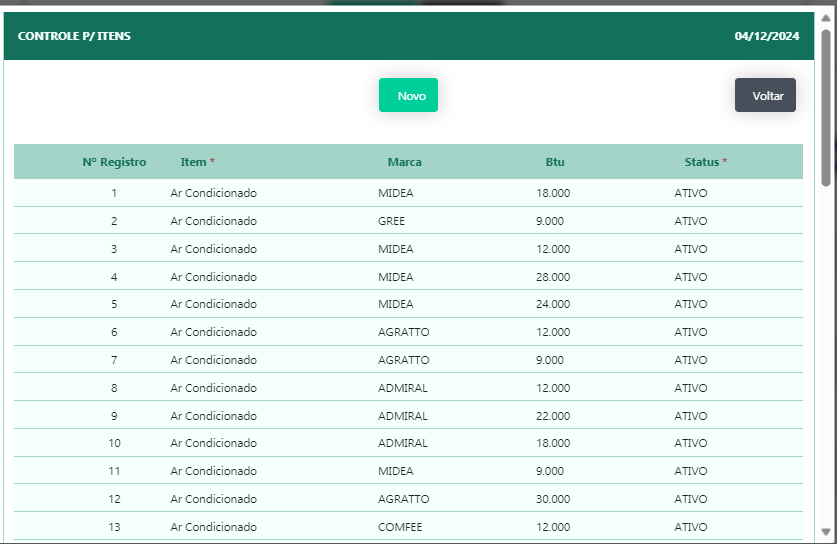
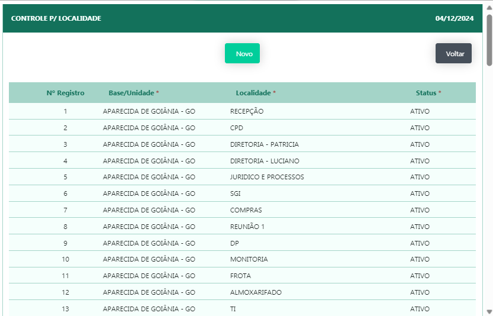

## Conservação das Instalações 

- **Descrição** : Aplicação para cadastro e edição das instalações de equipamentos e manutenção predial 

- **Passo a passo** :
Aplicação abre o filtro onde são passados os parametros para abertura de registros sendo eles.
- Nº de Registro
- Item
- Data de Manutenção / Data de Inspeção
- Ativo
- Status
- Base/Unidade 
- Data de Validade
- Nº Patrimonio 
Após a passagens dos parametros se abrirá o relatorio com os dados solicitados.

- Ao clicar no botão "NOVO" se abre um novo registro 

- **Cadastro de Novos itens** 

- Ao clicar no botão novo se abre um novo registro na ultima linha para inserção do registro.

- **Cadastro de localidades** 

- Ao clicar no botão novo se abre um novo registro na ultima linha para inserção do registro.

- Apos finalizar a inserção das informações deverá presionar o botão "INCLUIR" para salvar o registro.

- Ao clicar no icone de edição se abrirá uma nova tela para que se possa realizar a edição do registro e inclusão de anexos 

