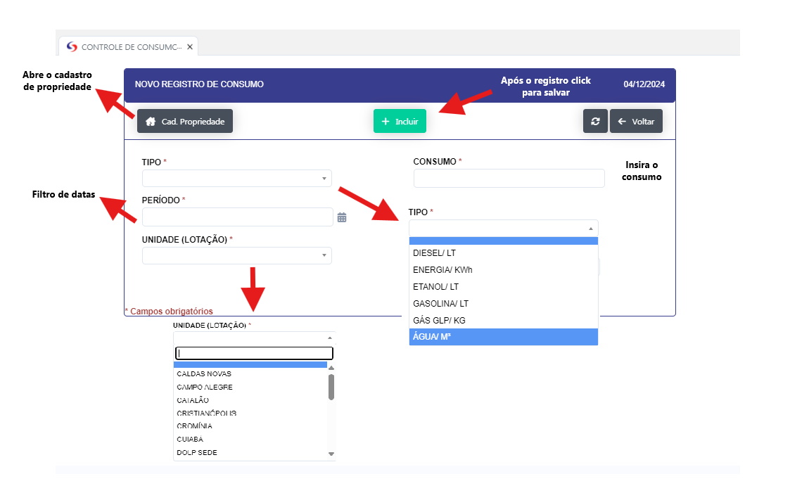
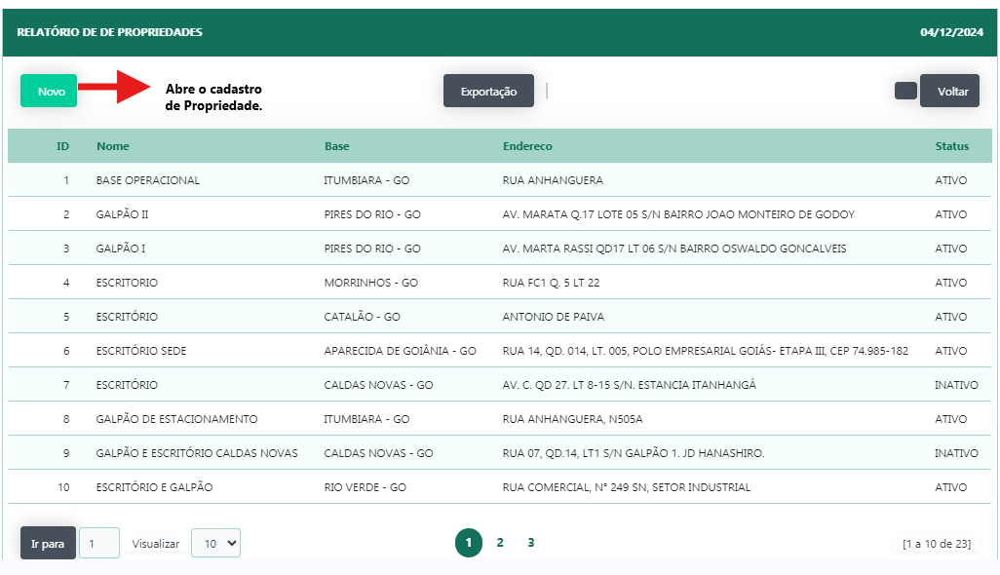
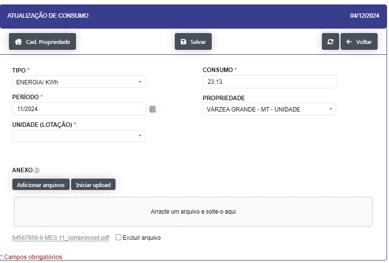

## Controle de Consumo 

- **Descrição** : Aplicação para cadastro e edição do consumo de recursos naturais , como agua , energia, gás, combustivéis , etc.

Aplicação abre o filtro onde são passados os parametros para abertura de registros sendo eles.

- localidade 
- Data Inclusão 
- Data Referente 

- **Passo a passo** :

- Ao clicar no botão "NOVO" se abre um novo registro

- Preencha os campos solicitados e clique no botão "INCLUIR" para salvar o registro.
- Tipo
- Periodo
- Unidade(Lotação)
- Consumo 

- Ao clicar no botão "NOVO " se abre um novo registro

- Preencha os campos solicitados e clique no botão "INCLUIR" para salvar o registro.

- Ao clicar no icone de edição se o item para edição

- Se insira os anexos clicando o botão Adicionar arquivos, Após a inserção clique no botão Iniciar upload

- Após o upload clique no botão "Salvar" para salvar o registro.