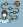
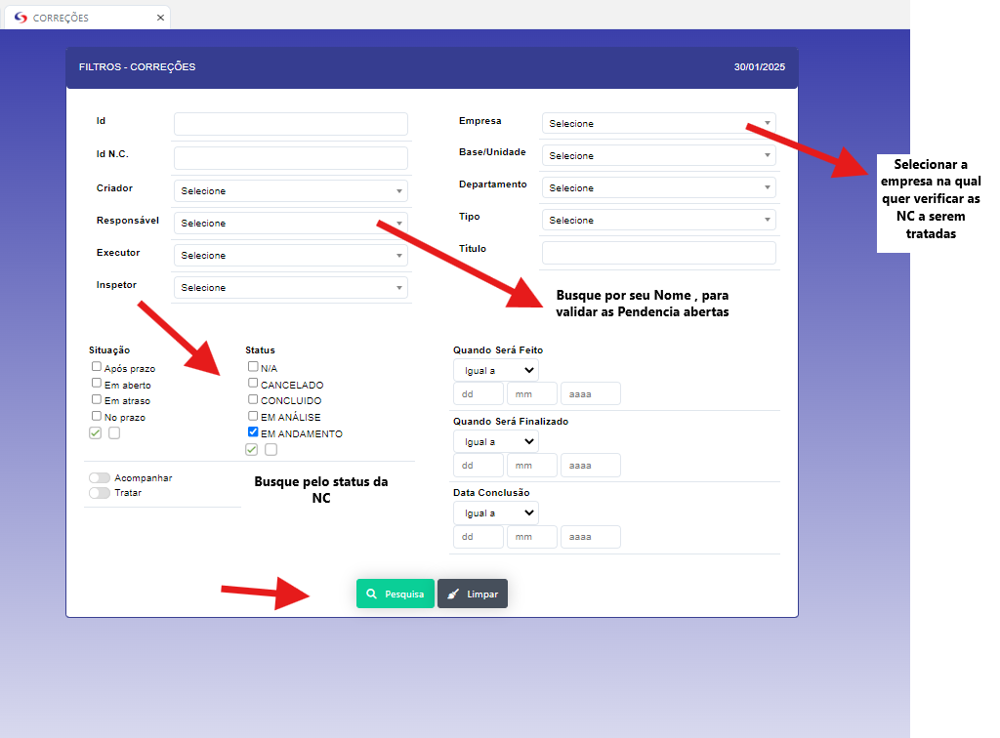
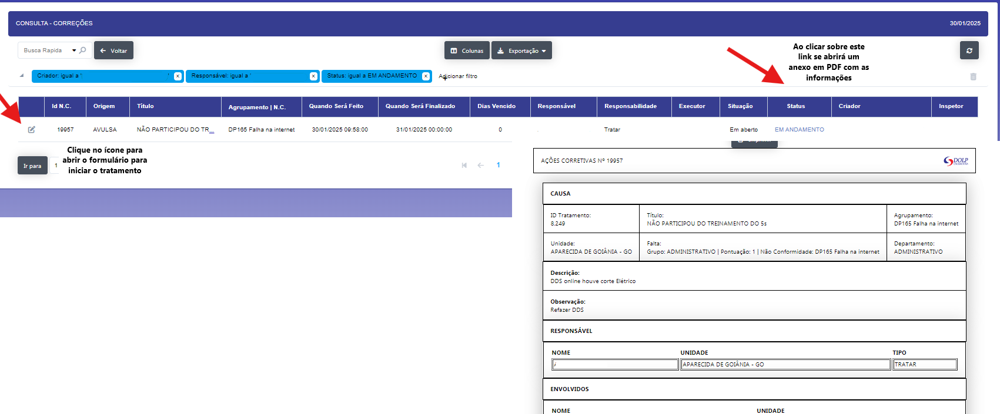
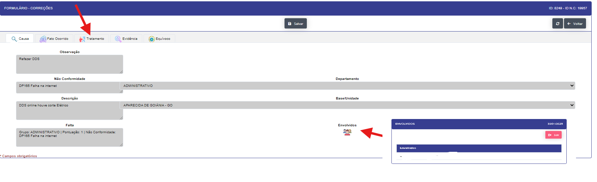
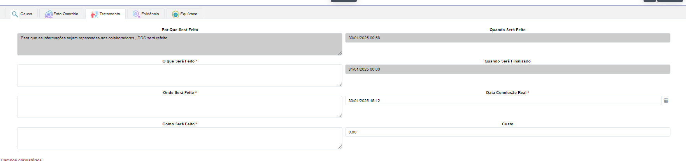
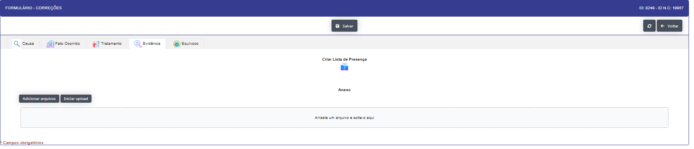
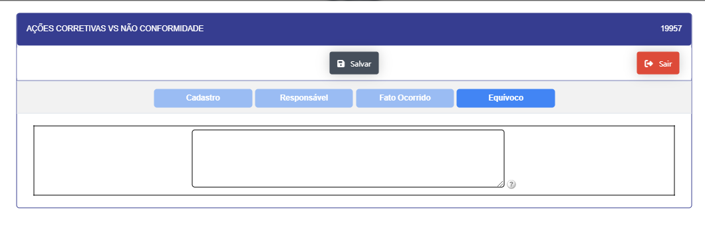
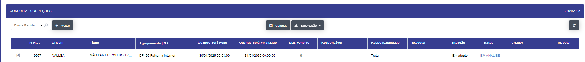

# Correções 

Aplicação para tratamento das não conformidade

A aplicação permite que o usuário possa realizar as correções necessárias para a não conformidades 

- A mesma abre de maneira inicial com o filtro onde deve ser passado os paramentros 

Exemplo de verificação 

Após realizada a passagem de parametros o relatorio sera aberto com as NC para a realização das correções ou acompanhamento.

Será aberto o formulario de correção para o tratamento da NC.

Pode se verificar as informações nas aba de detalhes. porem nosso foco será a aba de tratamento onde as infomações para o tratamento da nc serão inseridas.

Após o preenchimento das informações e clicar em salvar , e ir para aba de Evidência , onde será  anexado os documentos necessários para o tratamento da NC. Podendo ser anexos ou uma lista de presença do mesmo. 

- Caso a abertura da NC seja identificada algum equivoco preencha-o. porem a mesma esta sera validada pelo criador 

- Equivoco :

Após o preenchimento das etapas e clicar em salvar , voltará para tela inicial e a mesma mudará o status para em analise .

A validação da mesma e finaliza na aplicação de validação da NC.