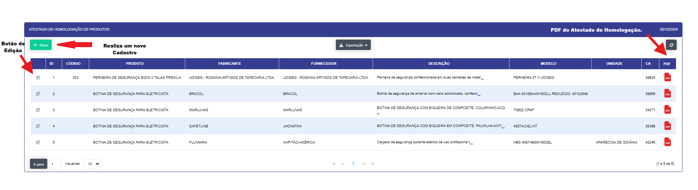

## Homologação de Produtos 

- **Descrição**:

Aplicação que retorna lista dos EPI's  homologados para uso para as equipes operacionais.

<label for="modal-toggle-24">

</label>
<input type="checkbox" id="modal-toggle-24" style="display:none;">

<label for="/sgi/homologacao_filtro.png" alt="Imagem Ampliada">

- **Passo a passo**:

- Aplicação abre em formato de filtro onde pode-se passar os parametros para a busca e abertura do relatório.
Sendo eles :

- Id de Homologação interna (DOLP).
- Codigo do produto (Sankhya).
- Fornecedor.
- Nome do Produto. 
- Fabricante do produto.
- Descrição do Produto.

- Ao selecionar os parametros para abertura do relatorio se abrirá abaixo a lista de produtos :

<label for="modal-toggle-25">

</label>
<input type ="checkbox" id="modal-toggle-25" style="display:none;">

<label for="/sgi/relata_homologação.png" alt="Imagem Ampliada">

- Ao clicar no botão "NOVO" se abrirá uma nova para que possa ser feito o cadastro da homologação de um novo produto.
<label for ="modal-toggle-27">

</label>
<input type="checkbox" id="modal-toggle-27" style="display:none;">

<label for="sgi/novo_homologa.png" alt="Imagem Ampliada">

- Ao abrir icone de "Edição se abrirá uma nova tela para que que se possa editar as informações do produto cadastrado.

<label for="modal-toggle-26">

</label>
<input type="checkbox" id="modal-toggle-26" style="display:none;">

<label for="sgi/edicao_produto.png" alt="Imagem Ampliada">

 

- Ao clicar no icone "PDF" se abrirá um documento em pdf do atestado de homologação do produto selecionado.

<label for="modal-toggle-28">

</label>
<input type="checkbox" id="modal-toggle-29" style="display:none;">

<label for="sgi/pdf_homologa.png" alt="Imagem Ampliada">

