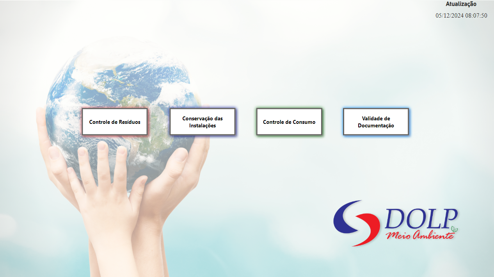
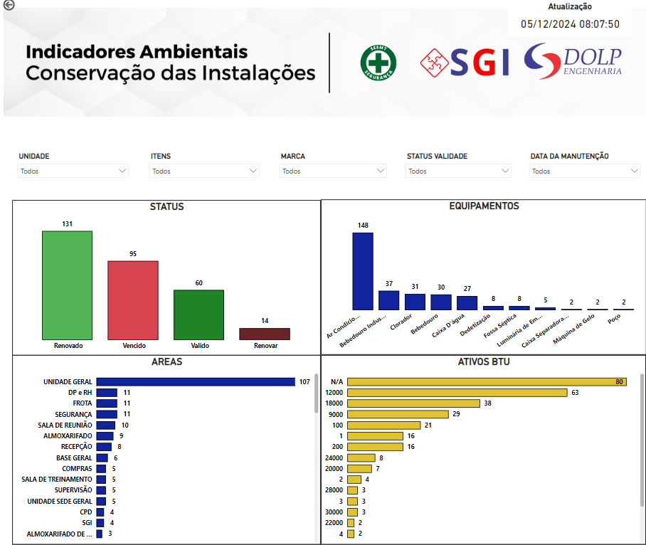

## Indicadores de Meio Ambiente 

- **Descrição** : Dashboard para visualização dos indicadores de meio ambiente da empresa.

Sendo quatro dashboard , cada um com indicadores específicos para cada área de meio ambiente: 

- **Passo a passo** : 

- Click em cada menu para visualizar os indicadores de meio ambiente da empresa.

- Controle de Resíduos 

- Conservação das Instalações 

- Controle de Consumo

- Validade de Documentação 

