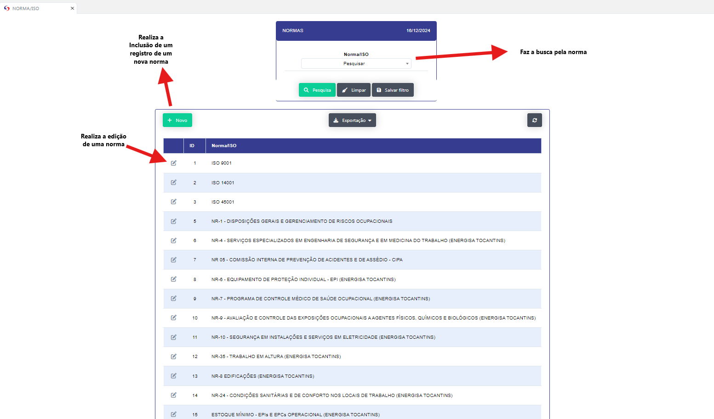
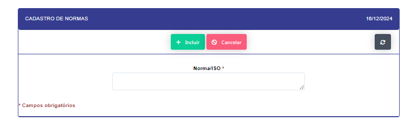

## Norma/Iso 

- **Descrição**: Realiza o cadastro das normas e isos da empresa.

- **Passo a Passo** : 

- Ao clicar no botão novo se abrirá um modal para um cadastro de um nova norma ou iso.

- Ao clicar no icone de edição , podera realizar as alterações necessárias na norma ou iso.

