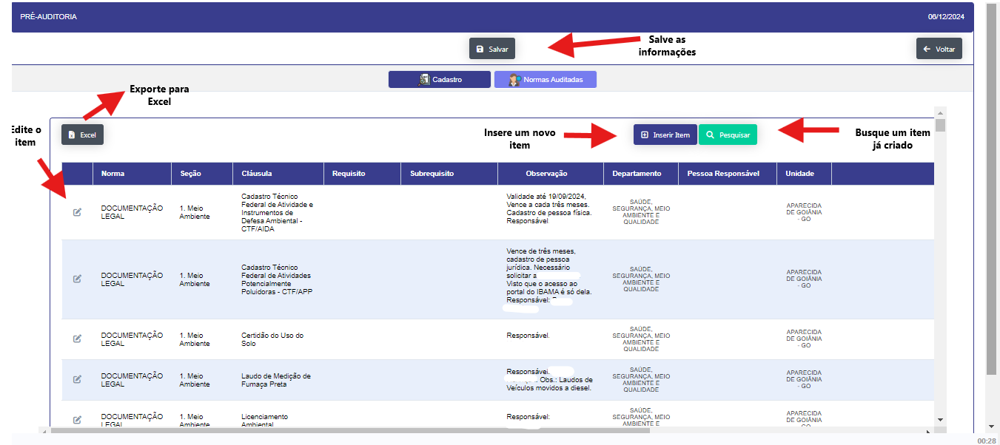

## Pré-Auditoria 

- **Descrição** : Aplicação para pré-auditoria da empresa.Gestão e preparação de documentos pré auditoria.

- **Passo a Passo** : 

- Ao clicar no botão "NOVO" abre uma nova janela para registro de um novo.

- Ao clicar no botão "PESQUISA" abre um novo filtro para pesquisa de documentos.

- Ao clicar no icone de edição abre uma janela para edição do documento.

- Abre um segunda Aba para inclusão dos itens e normas ao serem editados ao clicar no botão 

- Ao Clicar no botão "Inserir Item" 

- Ao clicar no icone de edição abre uma janela para edição do documento.

- Ao clicar em "Salvar ou Sair " volta a pagina inicial da pré-auditoria

- Ao clicar > Abre o detalhe do titulo da pré-auditoria.

