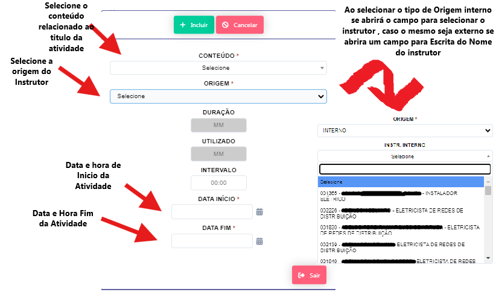
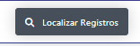
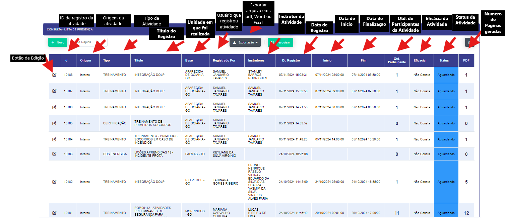
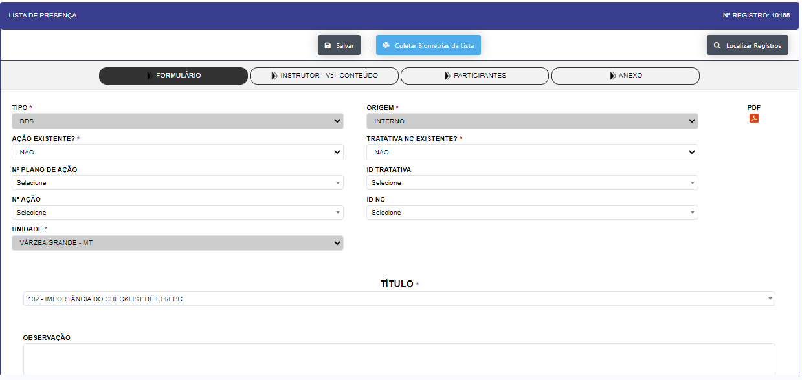
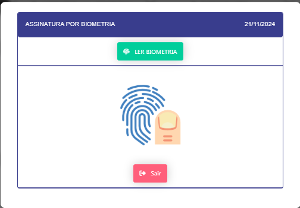

## Registrar  

- ### Inclusão - Tela Padrão de abertura

    <label for="modal-toggle-1">
    
    </label>
    <input type="checkbox" id="modal-toggle-1" style="display:none;">
    

    <label for="modal-toggle-1" class="close">&times;</label>
    
    

    - **Descrição**: Cria uma novo registro para ser assinado podendo ser treinamentos , DDS , Certificados , palestras , Tratativas de não conformidades e registros de eventos.

    - **Passo a Passo**:

    - No campo **TIPO** selecione a opção de  registro : 

        - Certificação 
        - DDS
        - DDS ENERGISAs
        - DDS EQUATORIAL 
        - DDS Equatorial Administrativo
        - DDS Equatorial Operacional 
        - DDS PRÁTICO
        - OUTRO 
        - PALESTRA 
        - SIPTMA 
        - TREINAMENTO

    - No campo **ORIGEM** selecione a opção 

        - INTERNO (Se o instrutor , palestrante for um colaborador DOLP)

        - EXTERNO (Se o instrutor , palestrante for uma pessoa externa)

    - No campo **AÇÃO EXISTENTE** selecione a opção caso a lista de presença seja fruto de um plano de ação 

        -  SIM 

        -  NÃO
    - No campo **NºPLANO DE AÇÂO** selecione o registro do numero do plano de ação caso este registro possua uma ação existente.

    (Na pratica esta realionada com a reposta acima caso a mesma seja positiva deverá selecionar na lista o numero do plano de ação a qual esta relacionado, caso negativa deixar em branco)

    - No campo **TRATATIVA NC EXISTENTE** selecione a opção caso a lista de presença seja parte da tratativa de uma Não conformidade

        -  SIM 

        -  NÃO
    - No campo **ID TRATATIVA** selecione o registro do ID da tratativa relacionado a lista de presença.

    (Na pratica esta relacionada com a reposta acima caso a mesma seja positiva deverá selecionar na lista o id da tratativa da NC a qual esta relacionado,caso negativa deixar em branco).

    - No campo **ID NC** selecione o registro do ID da Não conformidade referente ao id da tratativa da não conformidade caso a resposta acima seja positiva,caso negativa deixar em branco.

    - No campo **UNIDADE** selecione a unidade a qual está sendo realizado o registro. 

    - Após clicar no botão " + INCLUIR" se abrirá mas 3 abas sendo elas :

    - **INSTRUTOR - Vs- CONTEUDO**: 
    
    <label for="modal-toggle-2">
    
    </label>
    <input type="checkbox" id="modal-toggle-2" style="display:none;">
    

    <label for="modal-toggle-2" class="close">&times;</label>
    
    

    - Ao clicar no botão +novo se abrira uma tela para inclusão do conteudo da atividade

    <label for="modal-toggle-3">
    
    </label>
    <input type="checkbox" id="modal-toggle-3" style="display:none;">
    

    <label for="modal-toggle-3" class="close">&times;</label>
    
    

    - **PARTICIPANTES** :

    - Se abrirá um tela onde será inseridos  os participantes da lista de presença

    - Tendo duas opções :

    - a inserção manual no botão 

    <label for="modal-toggle-4">
    
    </label>
    <input type="checkbox" id="modal-toggle-4" style="display:none;">
    

    <label for="modal-toggle-4" class="close">&times;</label>
    
    

    - a automatizada de todos os colaboraboradores da unidade atraves do botão 

    - **ANEXO** : 

    Nesta aba se abrirá a opção para inserções de inserções dos arquivos.

    <label for="modal-toggle-5">
    
    </label>
    <input type="checkbox" id="modal-toggle-5" style="display:none;">
    

    <label for="modal-toggle-5" class="close">&times;</label>
    
    

    - #### Edição - Botão localizar registros 

    Se abre uma consulta onde se tem acesso aos registros já criador com suas informação principais e status onde em cada registro se tem acesso ao formulario para ediçao e tratativas adicionais e tambem a opção de coletar as assinatuturas biometricas da lista

    <label for="modal-toggle-6">
    
    </label>
    <input type="checkbox" id="modal-toggle-6" style="display:none;">
    

    <label for="modal-toggle-6" class="close">&times;</label>
    
    

    - Ao clicar no botão de edição se abrir o formulário do registro com as 4 abas abertas.

    <label for="modal-toggle-7">
    
    </label>
    <input type="checkbox" id="modal-toggle-7" style="display:none;">
    

    <label for="modal-toggle-7" class="close">&times;</label>
    
    

    - **Descrição**: Realiza a edição e acompanhamento dos registros para inclusão de anexos e solicitação de assinaturas por via biometrica.

    - **Passo a Passo**: 

    - No Botão " Coletar Biometrias da lista" se abre uma aplicação onde se poderá coletar a assinatura de todos os participantes da lista"  
        se abrirá uma aplicação para que se possa realizar as coletas das biometrias.

    <label for="modal-toggle-8">
    
    </label>
    <input type="checkbox" id="modal-toggle-8" style="display:none;">
    

    <label for="modal-toggle-8" class="close">&times;</label>
    
    

        