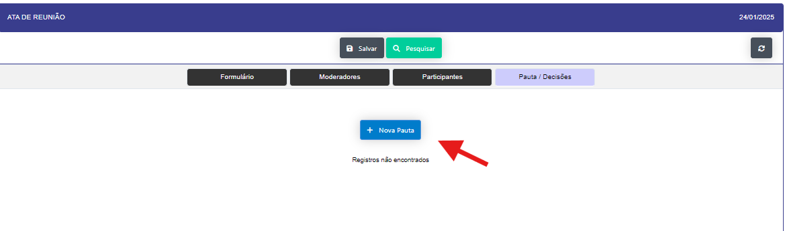

# Reuniões 
Aplicação se abre no formato de formulario , já para inclusão de uma nova ata de reunião. 
- Selecione o titulo da reunião.
- Insira a data da reunião.
- Selecione o local da reunião.
- Após a inclusão dos dados , precione o botão incluir para salvar a ata de reunião e se abrira um tela para o preenchimento dos registros da reunião.

**Moderadores**

O criador do reunião já e o moderador por padrão. Podendo ser adicionado mais moderadores. ao clicar no botão de novo moderador libera o campo para registro. Ao clicar no botão salvar, o moderador é adicionado.

**Participantes**

Ao clicar no botão de novo participante libera um novo campo para inclusão de um novo participante.

**Pauta/Decisões**

Ao clicar no botão de nova pauta , abre um modal para inclusão de uma nova pauta.

- Preencha os dados da ata de reunião e ao finalizar, clique no botão salvar os dados no decorrer da reunião 
para salvar a ata de reunião e preciso informar ao sistema que a ata de reunião foi concluida. e informa a data e hora fim e se existe ação para criação de um plano de ação.

Agora sim clique no botão salvar no cabeçalho do formulario para salvar a ata de reunião.