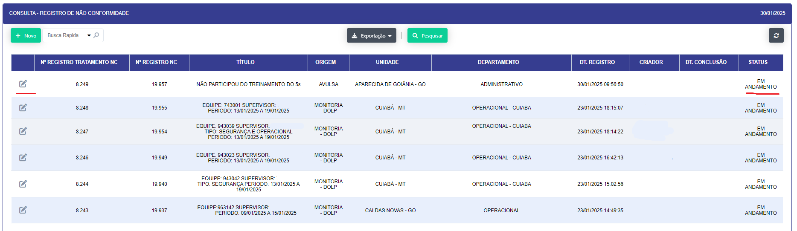

# Registro NC 

**Descrição :** 

Aplicação para consulta , registros , tratativas das não conformidades seja elas operacionais ou administrativas. 

- Ao a clicar no icone de novo se abrirá um formulario para o cadastro de uma nova não conformidade.

   

Após a Inclusão do titulo da não conformidade, o sistema irá gerar um código único para a não conformidade e se abrir na tela de detalhes da não conformidade.

Após a abertura do modal preencha os campos solicitados e clique em salvar para salvar a não conformidade.

Após o  preenchimento dos campos solicitados e clicar em salvar se abrirá as novas etapas do formulario para o tratamento da não conformidade.

Preencha as etapas :

- Responsavel : Responsavel pela não conformidade.

 Anexe os documentos necessários para o tratamento da não conformidade na etapa 

 - Fato Ocorrido : 

 

 Caso no tratamento da NC seja indentificado algum equivoco preencha-o 

 - Equivoco :

 

Após o preenchimento das etapas e clicar em salvar , voltará para tela inicial da edição da não conformidade.

Agora ao voltar para a tela inicial da edição da não conformidade , você poderá visualizar as etapas quando clicar no icone de detalhes.

Por aqui o criador da NC podera acompanhar o status da mesma. 