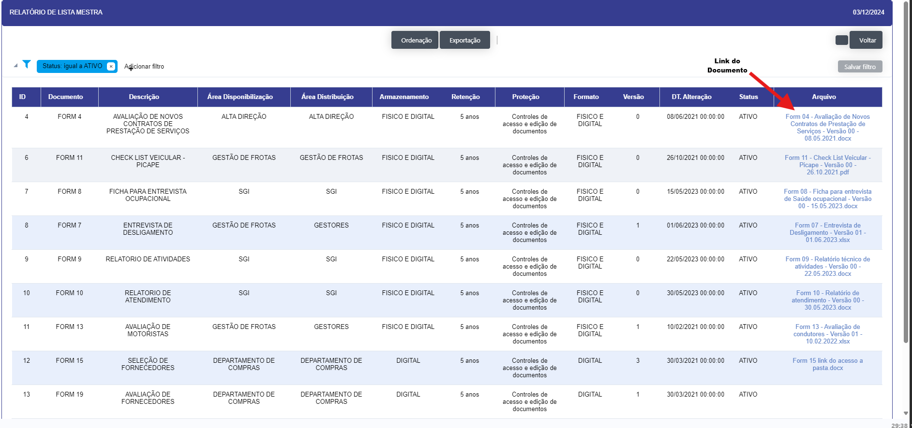

## Relatório 

- **Descrição**: Aplicação que permite a visualização dos documentos, procedimentos, áreas e niveis de acesso.

- **Passo a passo**: Aplicação abre em forma de filtro para que possa ser passado os parametros para a busca e abertura da lista de documentos, neste filtro nenhum dos parametros são obrigatórios.

- **Abre o Relatorio dos documentos da lista mestra** 

- Ao clicar no link na coluna arquivo, realizará o download do arquivo solicitado.