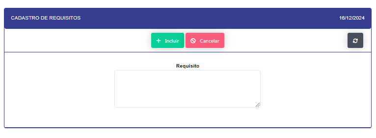
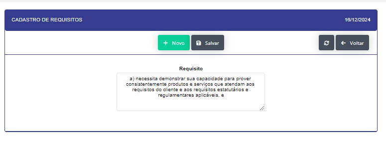

## Requisito 

- **Descrição**  : Reliaza o cadastro dos requisitos

- **Passo a Passo**  :

- Ao clicar no botão novo se abrirá um modal para um cadastro de um novo requisito.

- Ao clicar no icone de edição se abrirá um modal para a edição do requisito.

