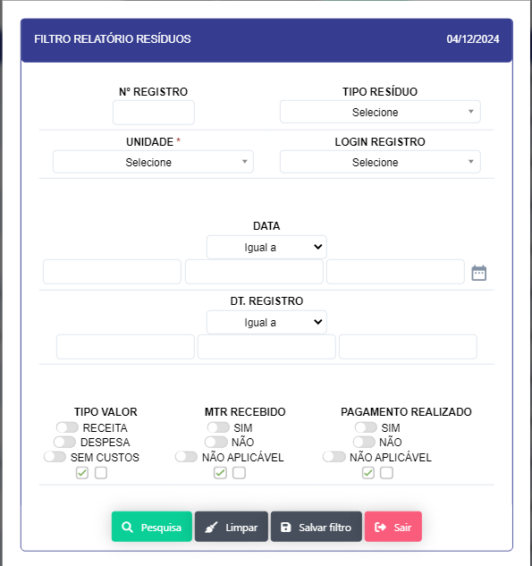
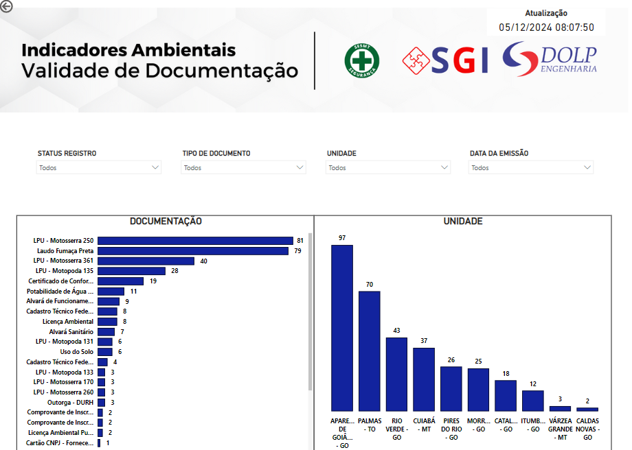

# SGI 

Menu dedicado as aplicação do departamento de SGI (Sistema de Gestão Integrada)

 - ## Homologação de Produtos 

    - **Descrição**: Aplicação que retorna lista dos EPI's  homologados para uso para as equipes operacionais.

    

    - **Passo a passo**:

    - Aplicação abre em formato de filtro onde pode-se passar os parametros para a busca e abertura do relatório.
      Sendo eles :
    - Id de Homologação interna (DOLP).
    - Codigo do produto (Sankhya).
    - Fornecedor.
    - Nome do Produto. 
    - Fabricante do produto.
    - Descrição do Produto.
    - Ao selecionar os parametros para abertura do relatorio se abrirá abaixo a lista de produtos :
    
     

     - Ao clicar no botão "NOVO" se abrirá uma nova para que possa ser feito o cadastro da homologação de um novo produto.
     
     
     
     - Ao abrir icone de "Edição se abrirá uma nova tela para que que se possa editar as informações do produto cadastrado.
    
     

     - Ao clicar no icone "PDF" se abrirá um documento em pdf do atestado de homologação do produto selecionado.

     

 - ## Lista mestra 
   Esta sessão esta destinada para o gerenciamento centralizadado de documentos, procedimentos, áreas e informações relacionadas ao niveis de acesso e armazenamento da informação.
  

    - ### Cadastro 
    
    - **Descrição**: Aplicação que permite o cadastro de documentos, procedimentos, aréas e niveis de acesso.

    - **Passo a passo**: 

    - Aplicação abre em forma de filtro para que possa ser passado os parametros para a busca e abertura da lista de documentos, neste filtro nenhum dos parametros são obrigatórios.

    - Ao clicar no botão "NOVO" se abrirá uma nova tela para que se possa realizar o cadastro de um novo documento.

    

    - Prencha os campos solicitados e clique no botão "INCLUIR" para realizar o cadastro do documento.

    - No relatorio aberto e possivel cliclar no ícone de "EDITAR" para realizar a edição do documento.

    

    - Ao clicar no link na coluna arquivo, realizará o download do arquivo solicitado.

    - ### Relatório 

    - **Descrição**: Aplicação que permite a visualização dos documentos, procedimentos, áreas e niveis de acesso.

    - **Passo a passo**: Aplicação abre em forma de filtro para que possa ser passado os parametros para a busca e abertura da lista de documentos, neste filtro nenhum dos parametros são obrigatórios.

    
  
    - **Abre o Relatorio dos documentos da lista mestra** 

    

  
    - Ao clicar no link na coluna arquivo, realizará o download do arquivo solicitado.

    - ### Cadastros auxiliares 

    Sub - menu para cadastro de documentos, áreas, indentificação e cadastro de proteção (nivéis de acesso)

     - #### Cadastro de documentos 

     - **Descrição** Aplicação para cadastro e edição dos nomes do documentos/procedimentos
     
     

     - Ao clicar no botão "NOVO" se abrirá uma nova tela para que se possa se realizado o novo registro.

     

     - Prencha os campos solicitados e clique no botão "INCLUIR" para realizar

     - Ao clicar no icone de edição se abrirá uma nova tela para que se possa realizar a edição do documento.

     

     - #### Cadastro de Área 

     - **Descrição** : Aplicação para cadastro e edição das áreas de atuação e disponilibilidade da informação.(Departamento)

     

     - **Passo a passo** : 

     - Ao clicar no botão "NOVO" se abrirá uma nova tela para que se possa se realizado o novo registro.

     
    
     - Prencha os campos solicitados e clique no botão "INCLUIR"

     - Ao clicar no icone de edição se abrirá uma nova tela para que se modificar um um registro já realizado. 

     

     - #### Cadastro de Identificação 

     - **Descrição** : Aplicação para cadastro e edição das identificações dos documento (Descrição). 

     

     - **Passo a passo** : 
     
     - Ao clicar no botão "NOVO" se abrirá uma nova tela para que se possa se realizado o novo registro

     

     - Ao clicar no icone de edição se abrirá uma nova tela para que se possa realizar a edição do registro.

     

     - #### Cadastro de Proteção  

     - **Descrição** : Aplicação para cadastro e edição das proteções dos documentos (Descrição), Departamento ou setor responsavel e seu respectivo nivel de acesso. 

     

     - **Passo a passo** :
    
     - Ao clicar no botão "NOVO" se abrirá uma nova tela para que se possa se realizado o novo registro

     

     - Ao clicar no icone de edição se abrirá uma nova tela para que se possa realizar a edição do registro.

     

     - Aqui se pode excluir ou editar ou registros. 

 - ## Meio Ambiente 
   Sub-menu de aplicação para gerenciamento de questões ambientais como : Conservação e manutenção dos equipamentos, controle de consumo de recursos naturais, gestão de resíduos, indicadores de meio ambiente, validação de documento e laudos.

    - ### Conservação das Instalações 

    - **Descrição** : Aplicação para cadastro e edição das instalações de equipamentos e manutenção predial 

    

    - **Passo a passo** :
    Aplicação abre o filtro onde são passados os parametros para abertura de registros sendo eles.
    - Nº de Registro
    - Item
    - Data de Manutenção / Data de Inspeção
    - Ativo
    - Status
    - Base/Unidade 
    - Data de Validade
    - Nº Patrimonio 
    Após a passagens dos parametros se abrirá o relatorio com os dados solicitados.

    

    - Ao clicar no botão "NOVO" se abre um novo registro 

    

    - **Cadastro de Novos itens** 

    

      - Ao clicar no botão novo se abre um novo registro na ultima linha para inserção do registro.

    - **Cadastro de localidades** 

    

      - Ao clicar no botão novo se abre um novo registro na ultima linha para inserção do registro.

    - Apos finalizar a inserção das informações deverá presionar o botão "INCLUIR" para salvar o registro.
    
    - Ao clicar no icone de edição se abrirá uma nova tela para que se possa realizar a edição do registro e inclusão de anexos 

    

    - ### Controle de Consumo 
  
    - **Descrição** : Aplicação para cadastro e edição do consumo de recursos naturais , como agua , energia, gás, combustivéis , etc.

    

    Aplicação abre o filtro onde são passados os parametros para abertura de registros sendo eles.
  
    - localidade 
    - Data Inclusão 
    - Data Referente 

    

    - **Passo a passo** :

    - Ao clicar no botão "NOVO" se abre um novo registro

    
    
    - Preencha os campos solicitados e clique no botão "INCLUIR" para salvar o registro.
    - Tipo
    - Periodo
    - Unidade(Lotação)
    - Consumo 
    
    

    - Ao clicar no botão "NOVO " se abre um novo registro

    

    - Preencha os campos solicitados e clique no botão "INCLUIR" para salvar o registro.

    - Ao clicar no icone de edição se o item para edição

    

    - Se insira os anexos clicando o botão Adicionar arquivos, Após a inserção clique no botão Iniciar upload

    - Após a edição clique no botão "SALVAR" para salvar as alterações.

    - ### Residuos 

    - **Descrição** : Aplicação para cadastro e edição dos resíduos gerados pela empresa, como lixo, efluentes, etc.
     
    - Aplicação Abre em formato de relatorio com os dados do resíduos gerados pela empresa.

    

    - **Passo a passo** : 

    - Ao clicar no botão "NOVO" se abre um novo registro

    
    
    - Ao clicar no botão "PESQUISA" se abrirá o filtro para que possa ser passados os parametros para uma busca personalizada. 

    

    - Ao clicar no icone de "EDIÇÃO" se abrirá o modal para edição do registro.

    

    - Após a edicão clique no botão "SALVAR" para salvar as alterações.

    - Na parte da tela inicial temos acesso os cadastros Auxiliares , que são:

    - **Cadastros de Residuos** 

    - **Descrição** : Aplicação para cadastro do tipo de registro de residuo.

    

    - **Passo a passo** :

    - Ao clicar no botão novo se abre um novo registro na ultima linha da tabela.

    - **Cadastros de Local Destino** 

    - **Descrição** : Aplicação para cadastro do local de destino(Parceiro) dos resíduos

    

    - **Passo a passo** :

    - Ao clicar no botão novo se abre um novo registro na ultima linha da tabela.

    - **Cadastro de Saída Tipo** 

    - **Descrição** : Aplicação para cadastro do tipo de saída dos residuos 

     

     - **Passo a passo** :

    - Ao clicar no botão novo se abre um novo registro na ultima linha da tabela.

    - ### Indicadores de Meio Ambiente 

    - **Descrição** : Dashboard para visualização dos indicadores de meio ambiente da empresa.

    Sendo quatro dashboard , cada um com indicadores específicos para cada área de meio ambiente: 

    

    - **Passo a passo** : 

    - Click em cada menu para visualizar os indicadores de meio ambiente da empresa.

    - Controle de Resíduos 

    

    - Conservação das Instalações 

    

    - Controle de Consumo

    

    - Validade de Documentação 

    

  - ### Validade de Documento  

  - **Descrição** : Aplicação para validação de documentos da empresa.

   

   Aplicação se abre em formato de relátorio com os documentos da empresa.

   

   - **Passo a Passo** :

   - Ao clicar no botão "NOVO" abre uma nova janela  para registro 

   

   - Ao clicar no botão "+ Tipo Documento" Abre uma janela para o registro de um novo tipo de documento.
  
   

   - Ao clicar no botão "NOVO" abre uma nova linha para registro de um novo documento.

   - Ao clicar no "Icone" de edição abre uma janela para edição do documento.

   
   
   - Insira os anexos se necessário 

   - Edite o documento e clique em salvar.

   - Ao clicar no botão no botão "Pesquisa" abre um novo filtro. 
   
   

   - Ao clicar no ícone "PDF" para abrir e realizar o download do documento ao clicar no link do mesmo. 
   
   

 - ## Auditoria Interna 

  Sub-menu para a pré-auditoria da empresa.

   - ### Pré-Auditoria 

   - **Descrição** : Aplicação para pré-auditoria da empresa.

   - **Passo a Passo** : 

   - ### Cadastrar Norma/Iso 

   - **Descrição**: Realiza o cadastro das normas e issos da empresa.

   - **Passo a Passo** :

   - ### Cadastros Auxiliares 

   - **Descrição**: Realiza o cadastro dos cadastros auxiliares referente a pré auditoria

   - **Passo a Passo** :

      - #### Norma/Iso 

      - **Descrição**: Realiza o cadastro das normas e issos da empresa.

      - **Passo a Passo** :

      - #### Capítulo/Seção 

      - **Descrição**: Realiza o cadastro dos capítulos e seções da empresa.

      - **Passo a Passo** :

      - #### Clásula 

      - **Descrição** : 

      - **Passo a Passo** : 

      - #### Requisito 

      - **Descrição**  :

      - **Passo a Passo**  :

      - #### Subrequisito 

      - **Descrição** :

      -

  
 - ## Lista de Presença  
   Esta sessão esta destinada as aplicação para registro e controle  de lista de presença, em treinamentos , DDS, Certificações, palestras, eventos corporativos e afins.

    - **IMPORTANTE**:  Está aplicação e gerenciada por niveis de acesso sendo eles

    -  ***CADASTRO*** (Tem permissão de realizar o registro das lista de presença de qualquer tipo)

    -  ***TITULO*** (Tem a permissão de criar os titulos para as listas de presença)

    -  ***EFICÁCIA***(Tem a permissão para avaliar a eficacia)

    -  ***RELATÓRIOS*** (Tem acesso aos relatorios dos registros)
    
    -  ***PRESENÇA*** (Acesso padrão a todos os usuarios do sistema para que possam assinar as listas de presença, podendo ser assinatura digital ou via biometrica)

    - ### Registrar   

        - #### Inclusão - Tela Padrão de abertura

        <label for="modal-toggle-1">
        
        </label>
        <input type="checkbox" id="modal-toggle-1" style="display:none;">
        

        <label for="modal-toggle-1" class="close">&times;</label>
        
        

        - **Descrição**: Cria uma novo registro para ser assinado podendo ser treinamentos, DDS, Certificados, palestras, Tratativas de não conformidades e registros de eventos.

        - **Passo a Passo**:

        - No campo **TIPO** selecione a opção de  registro : 
        - Certificação 
        - DDS
        - DDS ENERGISAs
        - DDS EQUATORIAL 
        - DDS Equatorial Administrativo
        - DDS Equatorial Operacional 
        - DDS PRÁTICO
        - OUTRO 
        - PALESTRA 
        - SIPTMA 
        - TREINAMENTO
        - No campo **ORIGEM** selecione a opção 
        - INTERNO (Se o instrutor , palestrante for um colaborador DOLP)
        - EXTERNO (Se o instrutor , palestrante for uma pessoa externa)
        - No campo **AÇÃO EXISTENTE** selecione a opção caso a lista de presença seja fruto de um plano de ação 
        -  SIM 
        -  NÃO
        - No campo **NºPLANO DE AÇÂO** selecione o registro do numero do plano de ação caso este registro possua uma ação existente.
        (Na pratica esta realionada com a reposta acima caso a mesma seja positiva deverá selecionar na lista o numero do plano de ação a qual esta relacionado, caso negativa deixar em branco)
        - No campo **TRATATIVA NC EXISTENTE** selecione a opção caso a lista de presença seja parte da tratativa de uma Não conformidade
        -  SIM 
        -  NÃO
        - No campo **ID TRATATIVA** selecione o registro do ID da tratativa relacionado a lista de presença.
        (Na pratica esta relacionada com a reposta acima caso a mesma seja positiva deverá selecionar na lista o id da tratativa da NC a qual esta relacionado,caso negativa deixar em branco).
        - No campo **ID NC** selecione o registro do ID da Não conformidade referente ao id da tratativa da não conformidade caso a resposta acima seja positiva,caso negativa deixar em branco.
        - No campo **UNIDADE** selecione a unidade a qual está sendo realizado o registro. 
        - Após clicar no botão " + INCLUIR" se abrirá mas 3 abas sendo elas :

        - **INSTRUTOR - Vs- CONTEUDO**: 
        
        <label for="modal-toggle-2">
        
        </label>
        <input type="checkbox" id="modal-toggle-2" style="display:none;">
        

        <label for="modal-toggle-2" class="close">&times;</label>
        
        

        - Ao clicar no botão "INCLUIR" se abrira uma tela para inclusão do conteudo da atividade

        <label for="modal-toggle-3">
        
        </label>
        <input type="checkbox" id="modal-toggle-3" style="display:none;">
        

        <label for="modal-toggle-3" class="close">&times;</label>
        
        

        - **PARTICIPANTES** :
        - Se abrirá um tela onde será inseridos  os participantes da lista de presença
        - Tendo duas opções :
        - a inserção manual no botão 

        <label for="modal-toggle-4">
        
        </label>
        <input type="checkbox" id="modal-toggle-4" style="display:none;">
        

        <label for="modal-toggle-4" class="close">&times;</label>
        
        

        - a automatizada de todos os colaboraboradores da unidade atraves do botão 

        - **ANEXO** : 

        Nesta aba se abrirá a opção para inserções de inserções dos arquivos.

        <label for="modal-toggle-5">
        
        </label>
        <input type="checkbox" id="modal-toggle-5" style="display:none;">
        

        <label for="modal-toggle-5" class="close">&times;</label>
        
        

        - #### Edição - Botão localizar registros 
        
        Se abre uma consulta onde se tem acesso aos registros já criador com suas informação principais e status onde em cada registro se tem acesso ao formulario para ediçao e tratativas adicionais e tambem a opção de coletar as assinatuturas biometricas da lista
        <label for="modal-toggle-6">
        
        </label>
        <input type="checkbox" id="modal-toggle-6" style="display:none;">
        

        <label for="modal-toggle-6" class="close">&times;</label>
        
        

        
        - Ao clicar no botão de edição se abrir o formulário do registro com as 4 abas abertas.
        <label for="modal-toggle-7">
        
        </label>
        <input type="checkbox" id="modal-toggle-7" style="display:none;">
        

        <label for="modal-toggle-7" class="close">&times;</label>
        
        

        - **Descrição**: Realiza a edição e acompanhamento dos registros para inclusão de anexos e solicitação de assinaturas por via biometrica.

        - **Passo a Passo**: 

        - No Botão " Coletar Biometrias da lista" se abre uma aplicação onde se poderá coletar a assinatura de todos os participantes da lista"  
            se abrirá uma aplicação para que se possa realizar as coletas das biometrias.

        <label for="modal-toggle-8">
        
        </label>
        <input type="checkbox" id="modal-toggle-8" style="display:none;">
        

        <label for="modal-toggle-8" class="close">&times;</label>
        
        

           
    - ### Cronograma de Treinamentos  

        Está seção abre o cronograma de treinamentos, a tela inicial se abre em forma consulta mostrandos as informações dos registros 

        <label for="modal-toggle-9">
        
        </label>
        <input type="checkbox" id="modal-toggle-9" style="display:none;">
        

        <label for="modal-toggle-9" class="close">&times;</label>
        
        

        - **Descrição**: 

        - Cria um planejamento dos treinamentos a serem realizados.

        - **Passo a passo** : 
        - Ao clicar no botão "NOVO" se abrirá um tela de cadastro de treinamento.
        - Data Inicial prevista 
        - Data de Validade 
        - Base 
        - Responsavel Treinamento
        - Público Alvo
        - Tipos 
        - Titulo 

        
    
     - ### Titulo 

         Sub-menu onde se da acesso a criação, edição e analise dos titulos criados para as atividades propostas as listas de presença

          - #### Cadastro 

            Esta aplicação onde são registrados os titulos das atividade e sua duração, ela abre um relatorio com os titulos já existentes.

            <label for="modal-toggle-10">
            
            </label>
            <input type="checkbox" id="modal-toggle-10" style="display:none;">
            

            <label for="modal-toggle-10" class="close">&times;</label>
            
            

         - **Descrição**: Aplicação para criação dos titulos das atividades, onde cada titulo atribui a uma tipo de registro.

         - **Passo a Passo** : Ao clicar no botão "NOVO" abrirá uma tela para criação de um novo titulo.
            <label for="modal-toggle-11">
            
            </label>
            <input type="checkbox" id="modal-toggle-11" style="display:none;">
            

            <label for="modal-toggle-11" class="close">&times;</label>
            
            
 

        - No campo "TIPO" deverá ser informado o tipo do registro vinculado ao titulo
        - No campo "GERA CERTIFICADO" deverá ser informado se a atividade gerá um certificado.
        - No campo ao Centro "SISTEMA DE GESTÃO" deverá ser informado o departamento responsavel pela atividade
        - No campo "Horas : Min" Deverá ser infomado a duração da atividade, onde após a inclusão sera convertido no campo "Duração em Minutos" 
        - No campo "TITULO" - deverá ser informado o titulo da atividade.
            
          - #### Relatório 

          - **Descrição**: Relatorio que trás os titulos criados para cada tipo de atividade, Aplicação se abre em formato de filtro onde deve-se passa os parametros para abertura do relatorio do item a ser buscado. 
          - **Passo a passo**:
          - No campo "Tipo" Selecione o tipo de atividade, ao qual se quer consultar os titulos criados
            Este campo es obrigatorio para a consulta os demais campos são para otimização da mesma sendo eles 
          - ID (numero do titulo)
          - SIGE (Sistema de Gestão - Departamento Responsavél)
          - TITULO Será retornada uma lista apartir do tipo de Atividade selecionada no campo "TIPO"
            <label for="modal-toggle-12">
            
            </label>
            <input type="checkbox" id="modal-toggle-12" style="display:none;">
            

            <label for="modal-toggle-12" class="close">&times;</label>
            
            
 

          - Após colocar os paramentros desejados ao clicar no botão "Pesquisa" , Se abriará  o relatorio com o resultado.
            <label for="modal-toggle-13">
            
            </label>
            <input type="checkbox" id="modal-toggle-13" style="display:none;">
            

            <label for="modal-toggle-13" class="close">&times;</label>
            
            
 
         
      - ### Relatório 

        Sub menu de relatorios personalizados 

           - #### Por Registro 

           - **Descrição** : Aplicação faz busca pelos id dos registro das atividades, Aplicação abre em formato de filtro que 
           após  a passagem de paramentros abre o relatorio. Relatorio focado nas principais informações da lista de presença se seu status,
           Podendo ser Aguardando(Ainda falta assinaturas e analise de eficacia), Cancelado(quando atividade proposta e cancelada),Eficaz(quando a atividade proposta teve suas assinaturas compostas e sua avaliação foi ineficaz) e Ineficaz(Quando a atividade fim não conseguiu chegar em seus objetivos)

            <label for="modal-toggle-14">
            
            </label>
            <input type="checkbox" id="modal-toggle-14" style="display:none;">
            

            <label for="modal-toggle-14" class="close">&times;</label>
            
            
 

           - **Passo a passo** : 
           - Selecione os campos que serão passados como parametros sendo eles :
           - Nº de Registro (Id da lista de presença)
           - Tipo : Selecione o tipo de atividade exemplo : DDS, Treinamento , Certificação.
           - Requerente : Seleciona o instrutor
           - Campos de datas: realiza um busca completa pelos paramentro das datas selecionadas.
           - Base : Unidade em qual foi realizada
           - SIGE : Sistema de Gestão - Departamento responsavel
           - Titulo : Realiza a busca pelos titulos das Atividades.

            <label for="modal-toggle-15">
            
            </label>
            <input type="checkbox" id="modal-toggle-15" style="display:none;">
            

            <label for="modal-toggle-15" class="close">&times;</label>
            
            
 

            - #### Por Instrutor 

            - **Descrição**: Aplicação faz busca pelos instrutores, mostrando as atividades realizadas pelo mesmo. Aplicação abre em forma de filtro para que possa ser passados os  paramentros para seu relatorio.

            <label for="modal-toggle-16">
            
            </label>
            <input type="checkbox" id="modal-toggle-16" style="display:none;">
            

            <label for="modal-toggle-16" class="close">&times;</label>
            
            
 

            - **Passo a passo** : 

            - Selecione os campos que serão passados como parametros sendo eles :
            - Nº de Registro (Id da lista de presença)
            - SIGE : Sistema de Gestão - Departamento responsavel.
            - Unidade : Unidade em qual foi realizada
            - Titulo : Realiza a busca pelos titulos das Atividades.
            - Filtro de Datas 
            - Status da Atividade 
            - Tipo : Selecione o tipo de atividade exemplo : DDS, Treinamento , Certificação.
            - Origem : Selecione se a atividade foi realizada por um instrutor INTERNO OU EXTERNO

            <label for="modal-toggle-17">
            
            </label>
            <input type="checkbox" id="modal-toggle-17" style="display:none;">
            

            <label for="modal-toggle-17" class="close">&times;</label>
            
            
 

             Apos a Abertura do relatorio e possivel acessar o registro em pdf de cada lista de presença atraves do Icone de PDF mostrado acima. Ao clicar se abrirá o Relatorio Abaixo.

            <label for="modal-toggle-18">
            
            </label>
            <input type="checkbox" id="modal-toggle-18" style="display:none;">
            

            <label for="modal-toggle-18" class="close">&times;</label>
            
            
  

            - #### Por Participante  

            - **Descrição** : Aplicação faz busca pelos participantes , mostrando as atividades realizadas pelo mesmo. Aplicação abre em forma de filtro para que possa ser passados os  paramentros para seu relatorio, retornando quais atividade para cada colaborador participou.

            <label for="modal-toggle-19">
            
            </label>
            <input type="checkbox" id="modal-toggle-19" style="display:none;">
            

            <label for="modal-toggle-19" class="close">&times;</label>
            
            
 

            - **Passo a Passo** 
            - Selecione os campos que serão passados como parametros sendo eles :
            - Nº de Registro (Id da lista de presença)
            - Tipo : Selecione o tipo de atividade exemplo : DDS, Treinamento , Certificação.
            - Titulo : Realiza a busca pelos titulos das Atividades.
            - INSTRUTOR : Selecione o registro do Instrutor
            - Filtro de Datas 
            - Presente :  Se o usuário estava presente sim ou não
            - Status da Atividade 
            - Unidade : Selecione a Unidade a qual a atividade foi realizada
            - PARTICIPANTES : Realiza a busca pelos participantes das atividades 
            Após setados os paramentros abrirá o relatorio conforme selecionado.

            <label for="modal-toggle-20">
            
            </label>
            <input type="checkbox" id="modal-toggle-20" style="display:none;">
            

            <label for="modal-toggle-20" class="close">&times;</label>
            
            
 

            - #### Feedback por Treinamento 

            Aplicação abre o relatorio do Feedback das atividades, tela se abre em forma de relatório mostrando as informação sobre a avaliação de cada treinamento

            <label for="modal-toggle-21">
            
            </label>
            <input type="checkbox" id="modal-toggle-21" style="display:none;">
            

            <label for="modal-toggle-21" class="close">&times;</label>
            
            
 

            - **Passo a Passo** 

            - Ao abrir o botão no icone de Avaliações se abrirá um modal retornando a avaliação de cada pergunta

            <label for="modal-toggle-22">
            
            </label>
            <input type="checkbox" id="modal-toggle-22" style="display:none;">
            

            <label for="modal-toggle-22" class="close">&times;</label>
            
            

            - Ao Abrir o botão ,se abrirá os seguintes campos onde se poderá passar os paramentros para a consulta.
            - ID Treinamento 
            - Instrutor 
            - Titulo 
            - Unidade 

            <label for="modal-toggle-23">
            
            </label>
            <input type="checkbox" id="modal-toggle-23" style="display:none;">
            

            <label for="modal-toggle-23" class="close">&times;</label>
            
            

        

        <a href="http://172.16.9.110:8000/SGD/sgd/#assinaturas-gerais">Veja como é realizada as assinaturas da lista de presença no sistema SGD</a>
        
Acesse o MENU SGD e selecione a opção ASSINATURAS GERAIS

        

        

