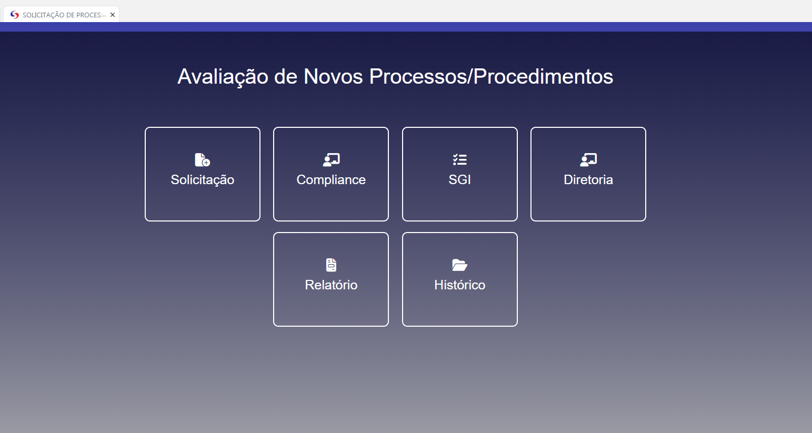
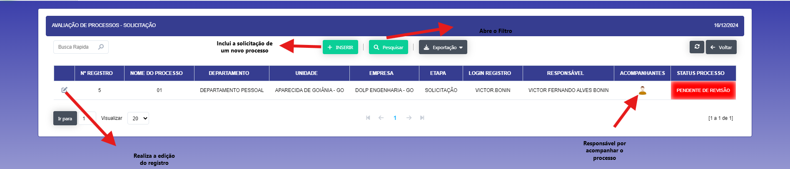
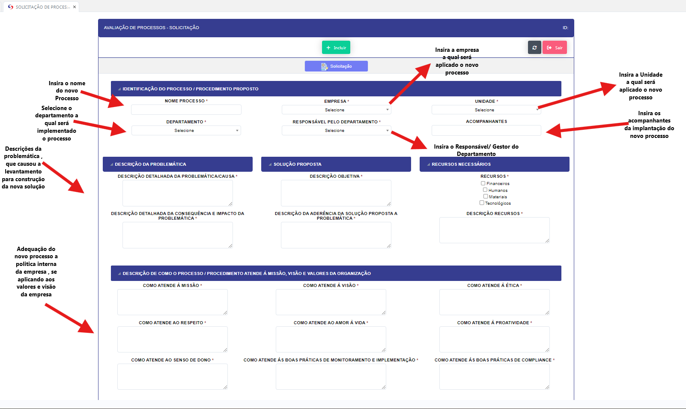
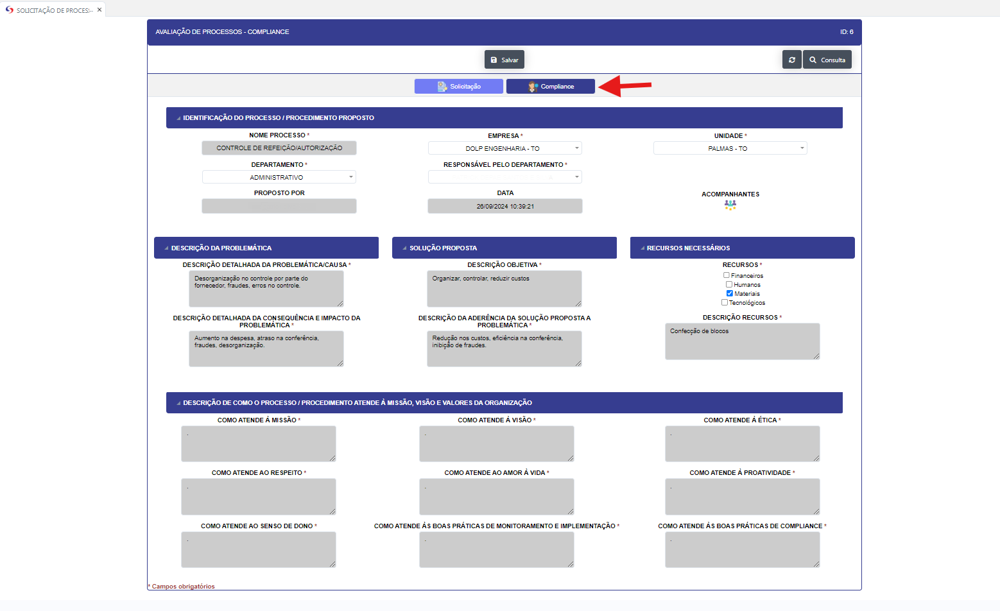
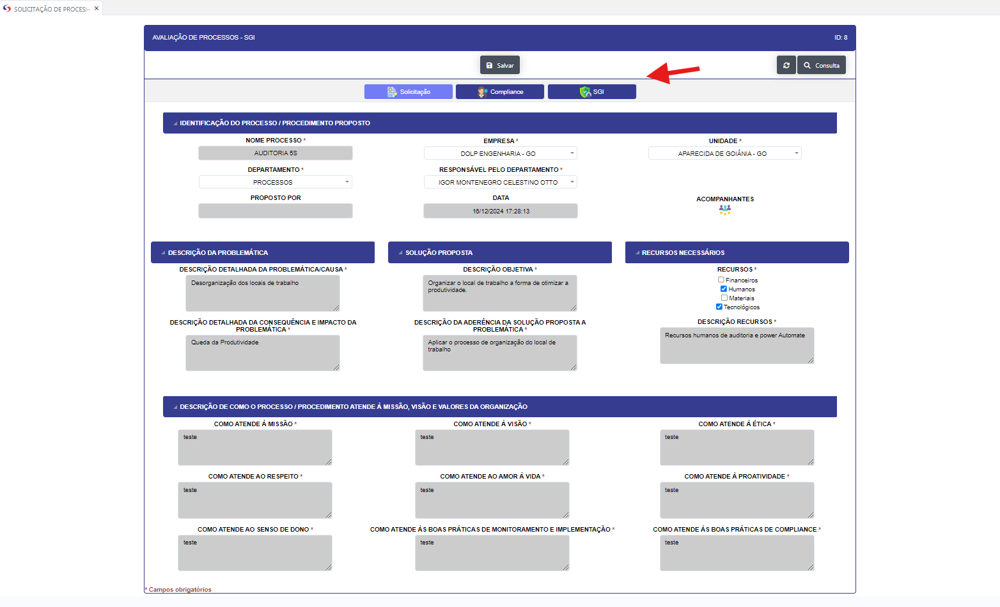
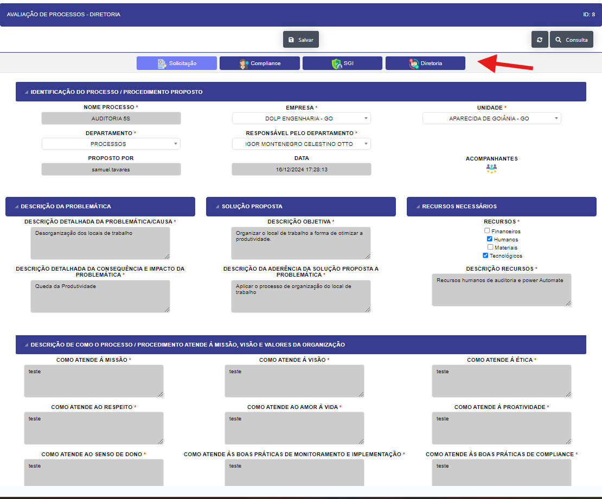
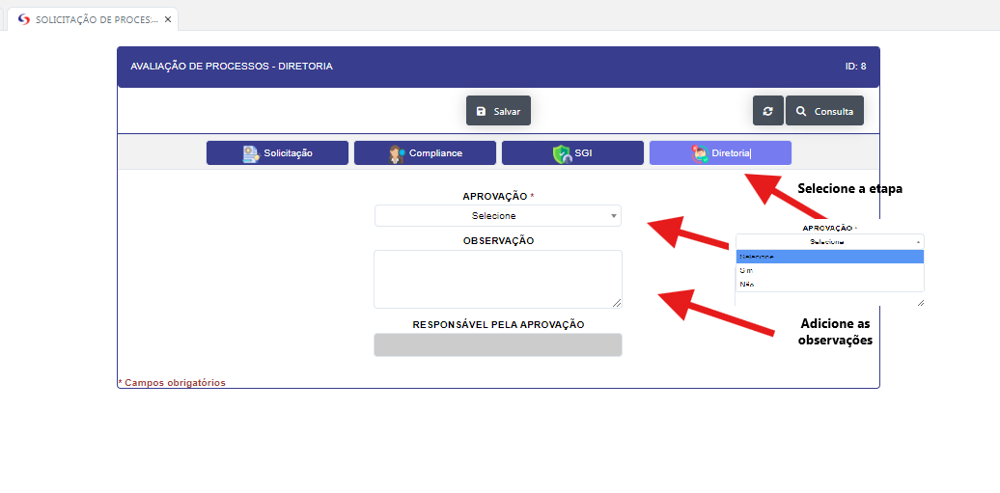
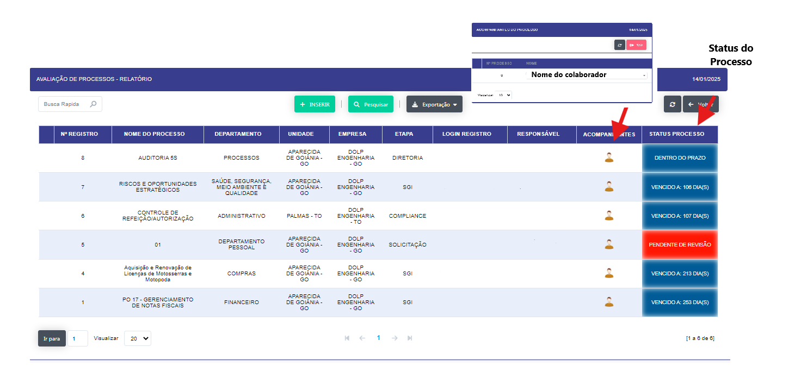
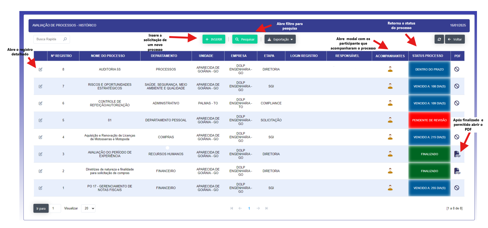
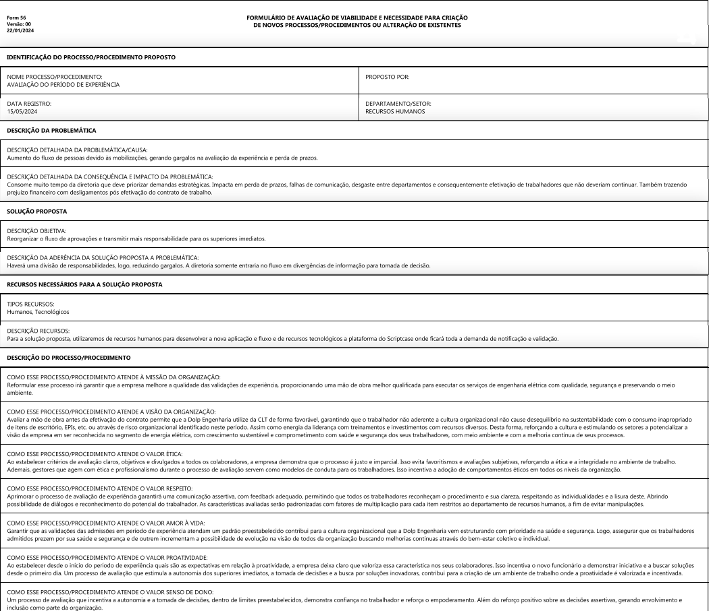

## Solicitação de Processos 

   - **Descrição** :
   
   Esta sessão esta destinada as aplicações de novos processos, procedimentos e fluxos de trabalho. A mesma abre um sub menu referente as etapas da criação a validação de novos processos.

   - Solicitação (Aqui se faz a solicitação de um novo processo)

   - Compliance  (Validação do Departamento de Compliance)

   - SGI         (Validação do Departamento de Gestão Integrada)

   - Diretoria   (Validação da Diretoria)

   - Relatorio   (Retorna o status de cada Solicitação)

   - Historico   (Exibe o historico de cada Solicitação)

  

   - **Passo a Passo** : 

   - Ao clicar no menu Solicitação, abre uma tela com os campos necessários para a solicitação de um novo processo.

   

   - Ao clicar no botão incluir abre uma tela para o preeenchimento de uma nova solicitação 

   
   

   - Após a solicitação ser criada, ela é enviada para a validação do Departamento de Compliance.

   

   

   -  Após a validação do Departamento de Compliance será enviada para o Departamento de Gestão Integrada.

   

   

   - Após a validação do Departamento de Gestão Integrada será enviada para a Diretoria.

   

   

   - Após todas as validações, o processo é criado e é possível visualizar o relatorios  das solicitação

   

   - Além disso, é possível visualizar o historico de cada solicitação.

   
   
   - Modelo do PDF do processo finalizado.

   
   

   