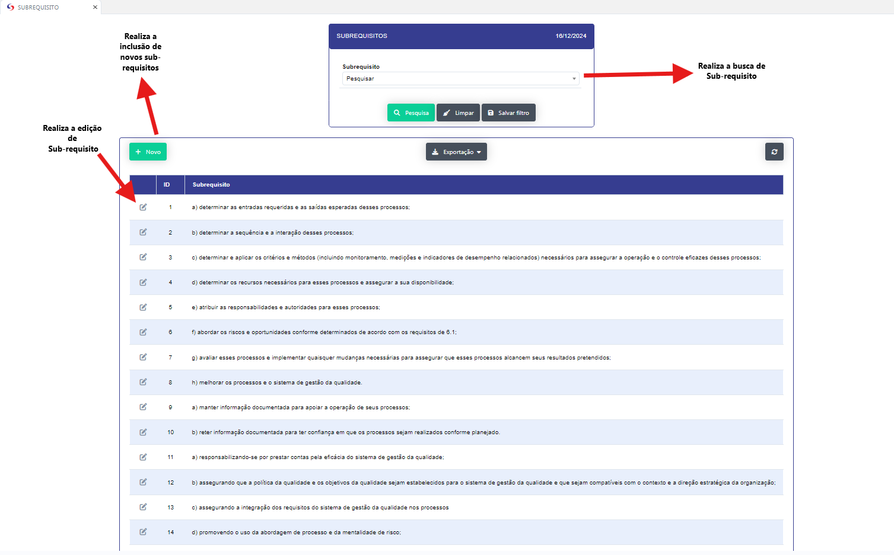
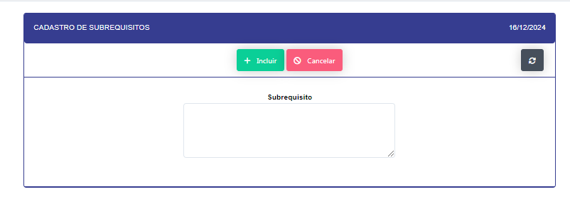
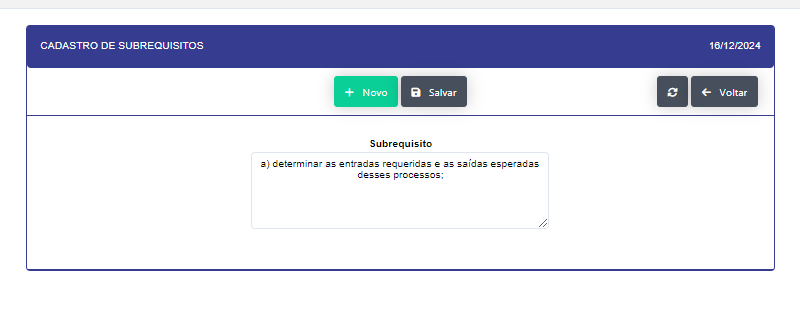

## Subrequisito 

- **Descrição** : Realiza o cadastro dos sub-requisitos.

- **Passo a Passo**  : 

- Ao clicar no botão novo se abrirá um modal para um cadastro de um novo sub-requisito.

- Ao clicar no icone de edição se abrirá um modal para a edição do sub-requisito.

