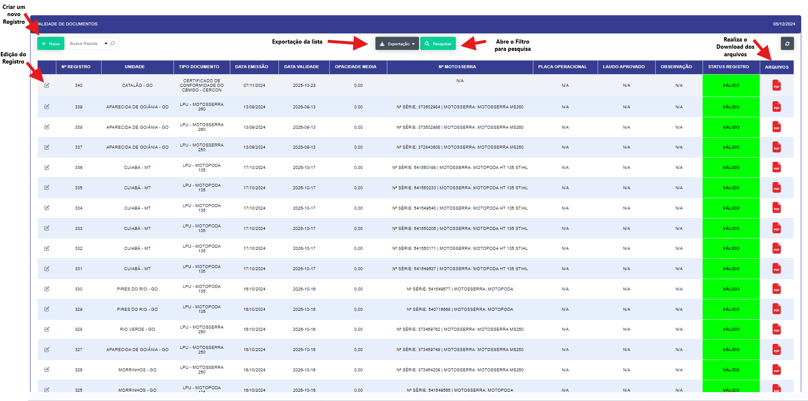
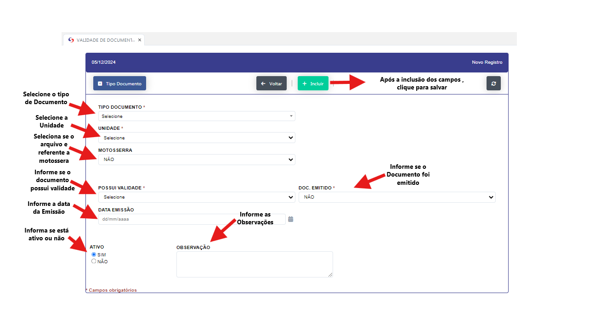
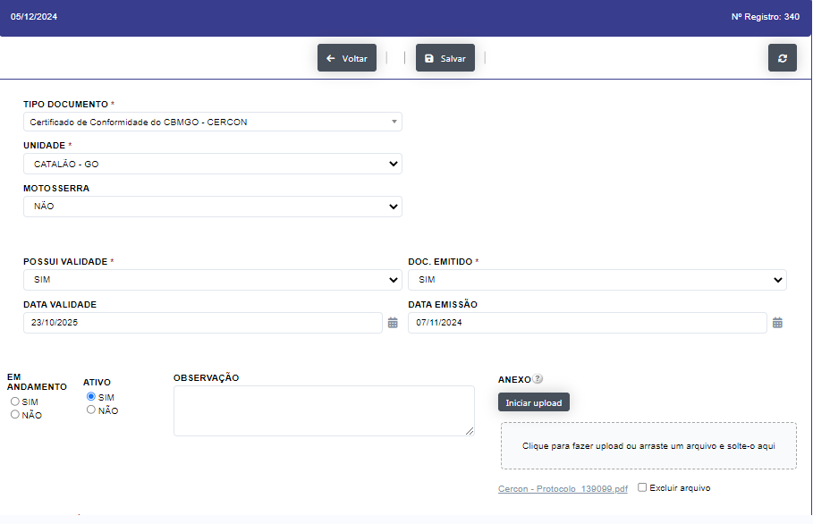
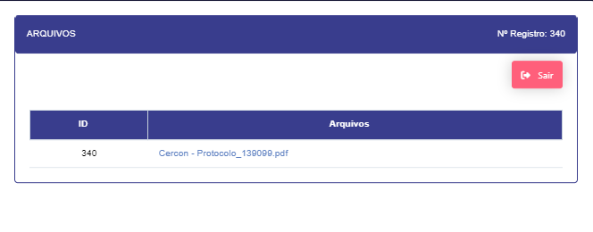

## Validade de Documento  

- **Descrição** : Aplicação para validação de documentos da empresa.

Aplicação se abre em formato de relátorio com os documentos da empresa.

- **Passo a Passo** :

- Ao clicar no botão "NOVO" abre uma nova janela  para registro 

- Ao clicar no botão "+ Tipo Documento" Abre uma janela para o registro de um novo tipo de documento.

- Ao clicar no botão "NOVO" abre uma nova linha para registro de um novo documento.

- Ao clicar no "Icone" de edição abre uma janela para edição do documento.

- Insira os anexos se necessário 

- Edite o documento e clique em salvar.

- Ao clicar no botão no botão "Pesquisa" abre um novo filtro. 

- Ao clicar no ícone "PDF" para abrir e realizar o download do documento ao clicar no link do mesmo. 

